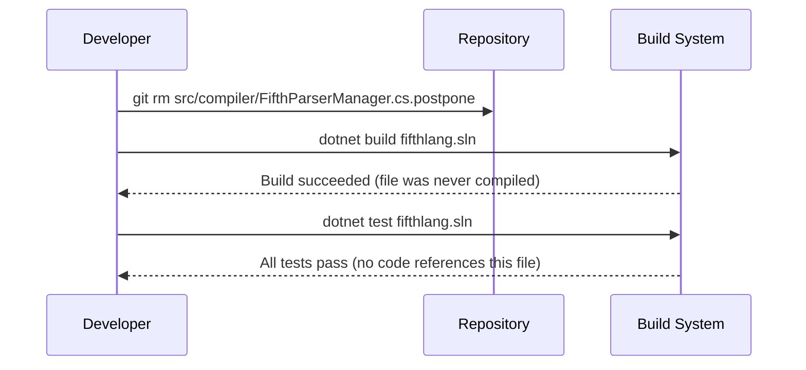

# Design Document: Delete FifthParserManager.cs.postpone

## Overview

Remove the legacy file `src/compiler/FifthParserManager.cs.postpone` (219 lines) from the repository. The file references the non-existent `il_ast` namespace, has a `.postpone` extension that prevents compilation, and misleads contributors into thinking an IL pipeline exists. This is a zero-risk cleanup: delete one inert file, verify the build and tests still pass.

## Main Algorithm/Workflow



## Core Interfaces/Types

No interfaces or types are affected. The `.postpone` file is excluded from compilation by its extension and is not referenced by any project file, `using` directive, or build target in the solution.

```csharp
// No code changes required.
// The file src/compiler/FifthParserManager.cs.postpone:
//   - Has a .postpone extension → not included in any .csproj glob
//   - References non-existent namespace: il_ast
//   - References non-existent namespace: compiler.LangProcessingPhases
//   - Contains a stale copy of FifthParserManager with an obsolete pipeline
```

## Key Functions with Formal Specifications

### Operation: deletePostponeFile()

```csharp
// Conceptual operation — executed via git rm, not code
void DeletePostponeFile()
{
    File.Delete("src/compiler/FifthParserManager.cs.postpone");
}
```

**Preconditions:**
- `src/compiler/FifthParserManager.cs.postpone` exists in the repository working tree
- The file is not referenced by any `.csproj` `<Compile>` or `<None>` item
- No source file contains a `using` or import that depends on symbols defined only in this file

**Postconditions:**
- `src/compiler/FifthParserManager.cs.postpone` no longer exists in the working tree or git index
- `dotnet build fifthlang.sln` succeeds with exit code 0
- `dotnet test fifthlang.sln` succeeds with all tests passing
- No new compiler warnings introduced

**Loop Invariants:** N/A (single atomic operation)

## Example Usage

```bash
# Step 1: Delete the file
git rm src/compiler/FifthParserManager.cs.postpone

# Step 2: Verify build
dotnet build fifthlang.sln
# Expected: Build succeeded. 0 Error(s).

# Step 3: Verify tests
dotnet test fifthlang.sln
# Expected: All tests passed.

# Step 4: Commit
git commit -m "REM-001: Delete legacy FifthParserManager.cs.postpone"
```

## Correctness Properties

*A property is a characteristic or behavior that should hold true across all valid executions of a system — essentially, a formal statement about what the system should do. Properties serve as the bridge between human-readable specifications and machine-verifiable correctness guarantees.*

This feature involves deleting a single inert file. All acceptance criteria are concrete, one-shot verifications (file existence, build success, test success) rather than universally quantified properties over a class of inputs. No property-based tests are applicable.

### Verification 1: No compilation dependency

The `.postpone` extension ensures the file is never included in any MSBuild compilation glob (`**/*.cs`). Deleting it cannot break the build.

**Validates: Requirement 2.1**

### Verification 2: No runtime dependency

No assembly, test, or script references `FifthParserManager.cs.postpone` by path or loads symbols from it.

**Validates: Requirement 3.1**

### Verification 3: Idempotent verification

Running `dotnet build` and `dotnet test` before and after deletion produces identical success results — the file is inert.

**Validates: Requirements 2.1, 3.1**
