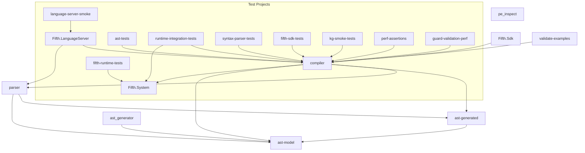
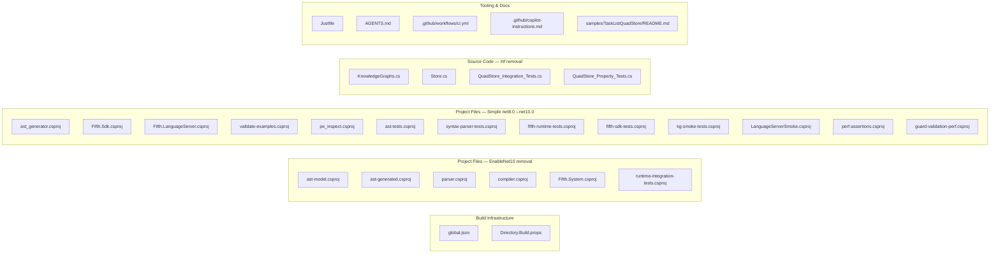

# Design Document: .NET 10 Migration

## Overview

This design describes the migration of the Fifth Language solution (`fifthlang.sln`) from .NET 8 to .NET 10. The migration is a "big bang" approach: every project, script, CI pipeline, and sample switches to `net10.0` in a single coordinated change. No multi-targeting or backward compatibility with .NET 8 is retained.

The migration touches four layers:

1. **Build infrastructure** — `global.json`, `Directory.Build.props`, all `.csproj` files
2. **Source code** — removal of `#if NET10_0_OR_GREATER` / `#else` / `#endif` blocks and the `EnableNet10` MSBuild property
3. **Dependencies** — NuGet package version bumps for .NET 10 compatibility
4. **Tooling & docs** — Justfile, CI workflow, AGENTS.md, sample projects

### Key Design Decisions

| Decision | Rationale |
|---|---|
| Single target `net10.0` (no multi-targeting) | Eliminates conditional complexity; the project has no downstream consumers that require .NET 8 |
| `rollForward: latestFeature` in global.json | Allows patch-level SDK updates within .NET 10 without manual pinning |
| `allowPrerelease: false` | Ensures stable SDK only; the current `true` was needed during .NET 10 preview period |
| Keep `UsePinnedRoslyn` mechanism | Still valuable for CI/Release determinism; only the Roslyn version number changes |
| QuadStore packages become unconditional | With net10.0 as sole target, the conditional `<ItemGroup>` for QuadStore is no longer needed |

## Architecture

The migration does not alter the solution's architecture. The dependency graph between projects remains identical:



### Migration Scope by File Category



## Components and Interfaces

### 1. global.json

**Current state:**
```json
{
    "sdk": {
        "version": "8.0.414",
        "rollForward": "latestMajor",
        "allowPrerelease": true
    }
}
```

**Target state:**
```json
{
    "sdk": {
        "version": "10.0.100",
        "rollForward": "latestFeature",
        "allowPrerelease": false
    }
}
```

The exact `10.0.xxx` patch version should be the latest stable .NET 10 SDK available at migration time. `rollForward: latestFeature` allows the SDK to roll forward within the 10.0 band.

### 2. Directory.Build.props

Changes required:
- **RoslynVersion**: Update from `4.11.0` to a .NET 10-compatible version (e.g., `4.14.0` or later). The comment about Roslyn 4.14.0 breaking under .NET 8 is no longer relevant and should be removed.
- **LangVersion**: The `UsePinnedRoslyn` conditional remains, but the comment should reference C# 14 / .NET 10 instead of .NET 8/9.
- **SystemReflectionMetadataVersion**: Update from `9.0.0` to `10.0.0`.
- Remove the comment: `"Note: 4.14.0 requires System.Runtime 9.0 (NET 9) which breaks under our .NET 8 SDK."`

### 3. Project Files with EnableNet10 Multi-Targeting (6 projects)

These projects currently have the conditional multi-targeting pattern:
```xml
<TargetFrameworks Condition="'$(EnableNet10)' == 'true'">net8.0;net10.0</TargetFrameworks>
<TargetFrameworks Condition="'$(EnableNet10)' != 'true'">net8.0</TargetFrameworks>
```

Each will be replaced with:
```xml
<TargetFramework>net10.0</TargetFramework>
```

Affected projects:
- `src/ast-model/ast_model.csproj`
- `src/ast-generated/ast_generated.csproj`
- `src/parser/parser.csproj`
- `src/compiler/compiler.csproj`
- `src/fifthlang.system/Fifth.System.csproj`
- `test/runtime-integration-tests/runtime-integration-tests.csproj`

### 4. Project Files with Simple net8.0 Target (13 projects)

These projects have `<TargetFramework>net8.0</TargetFramework>` and simply need it changed to `<TargetFramework>net10.0</TargetFramework>`:

- `src/ast_generator/ast_generator.csproj`
- `src/Fifth.Sdk/Fifth.Sdk.csproj`
- `src/language-server/Fifth.LanguageServer.csproj`
- `src/tools/validate-examples/validate-examples.csproj`
- `src/tools/pe_inspect/pe_inspect.csproj`
- `test/ast-tests/ast_tests.csproj`
- `test/syntax-parser-tests/syntax-parser-tests.csproj`
- `test/fifth-runtime-tests/fifth-runtime-tests.csproj`
- `test/fifth-sdk-tests/fifth_sdk_tests.csproj`
- `test/kg-smoke-tests/kg-smoke-tests.csproj`
- `test/language-server-smoke/LanguageServerSmoke.csproj`
- `test/perf/perf-assertions/perf-assertions.csproj`
- `test/perf/guard-validation-perf/guard-validation-perf.csproj`

### 5. Conditional ItemGroups to Merge

Two project files have `<ItemGroup Condition="'$(TargetFramework)' == 'net10.0'">` for QuadStore packages:

- `src/fifthlang.system/Fifth.System.csproj` — move `QuadStore.Core` and `QuadStore.SparqlServer` into the unconditional `<ItemGroup>`
- `test/runtime-integration-tests/runtime-integration-tests.csproj` — same treatment

### 6. Source Code — Conditional Compilation Removal

Four C# files contain `#if NET10_0_OR_GREATER` blocks:

| File | Blocks | Action |
|---|---|---|
| `src/fifthlang.system/KnowledgeGraphs.cs` | 2 blocks | Keep `#if` branch code, remove `#else` branch and directives |
| `src/fifthlang.system/Store.cs` | 2 blocks (using + method) | Keep `#if` branch code, remove `#else` branch and directives |
| `test/runtime-integration-tests/QuadStore_Integration_Tests.cs` | 4 blocks | Remove `#if`/`#endif` wrappers, keep enclosed code |
| `test/runtime-integration-tests/QuadStore_Property_Tests.cs` | 1 file-level block | Remove `#if`/`#endif` wrappers, keep enclosed code |

For `Store.cs`, the `#if NET10_0_OR_GREATER` using directive `using QuadStoreNs = TripleStore.Core;` becomes unconditional.

For `KnowledgeGraphs.cs`:
- `CreateStore()`: keep the QuadStore path, remove the `#else` in-memory fallback
- `local_store()`: remove the `#if`/`#endif` wrapper, keep the method

### 7. NuGet Package Updates

Current versions and target updates (latest stable compatible with net10.0):

| Package | Current | Target | Used In |
|---|---|---|---|
| `Microsoft.NET.Test.Sdk` | 17.9.0 | latest 17.x | all test projects |
| `xunit` | 2.9.2 | latest 2.x | all test projects |
| `xunit.runner.visualstudio` | 2.8.2 | latest 2.x | all test projects |
| `FluentAssertions` | 6.12.0 / 6.0.0-alpha0002 | latest 6.x or 7.x | parser, test projects |
| `FsCheck` | 2.16.6 | latest 2.x or 3.x | ast-tests |
| `FsCheck.Xunit` | 2.16.6 | latest 2.x or 3.x | ast-tests, runtime-integration-tests, syntax-parser-tests |
| `Antlr4.Runtime.Standard` | 4.13.1 | latest 4.13.x | parser, ast-tests |
| `dotNetRdf` | 3.4.1 | latest 3.x | Fifth.System |
| `Microsoft.CodeAnalysis.CSharp` | 4.11.0 | matches new RoslynVersion | compiler, runtime-integration-tests |
| `System.Reflection.MetadataLoadContext` | 8.0.0 | 10.0.0 | compiler |
| `System.Reflection.Metadata` | via `$(SystemReflectionMetadataVersion)` 9.0.0 | 10.0.0 | pe_inspect, runtime-integration-tests |
| `Microsoft.Extensions.Logging.Console` | 8.0.0 | 10.0.0 | language-server |
| `BenchmarkDotNet` | 0.13.8 | latest 0.14.x | guard-validation-perf |
| `coverlet.collector` | 6.0.0 | latest 6.x | ast-tests, runtime-integration-tests |
| `OmniSharp.Extensions.LanguageServer` | 0.19.9 | latest compatible | language-server |
| `OmniSharp.Extensions.LanguageProtocol` | 0.19.9 | latest compatible | language-server |
| `RazorLight` | 2.3.1 | latest compatible | ast_generator |
| `Dunet` | 1.11.2 / 1.11.3 | latest 1.x | ast-model, Fifth.System |
| `Vogen` | 6.0.0 | latest 6.x | ast-model |
| `Microsoft.Build` | 17.9.6 | latest 17.x | fifth-sdk-tests |
| `AutoFixture` | 4.18.1 | latest 4.x | ast-tests |
| `Microsoft.Net.Compilers.Toolset` | `$(RoslynVersion)` 4.11.0 | matches new RoslynVersion | Directory.Build.props (conditional) |

Note: `FluentAssertions` in `parser.csproj` is currently at `6.0.0-alpha0002` which should be aligned with the other projects at the latest stable version.

### 8. Build Scripts and Tooling

**Justfile** — Two `install-cli` recipes reference `net8.0` output paths:
```
ln -s "$(pwd)/src/compiler/bin/Release/net8.0/compiler" ~/bin/fifth
ln -s "$(pwd)/src/compiler/bin/Debug/net8.0/compiler" ~/bin/fifth
```
Both change to `net10.0`.

**AGENTS.md** — The prerequisites section references `.NET 8.0.x`:
```
dotnet --version  # Should show 8.0.x (global.json uses 8.0.118)
```
Update to reference .NET 10.

**CI workflow** (`.github/workflows/ci.yml`) — `dotnet-version: '8.0.415'` changes to `'10.0.xxx'` (latest stable).

**Copilot instructions** (`.github/copilot-instructions.md`) — Multiple references to `.NET 8.0 SDK`, `8.0.118`, `8.0.x` need updating to .NET 10.

**Sample README** (`samples/TaskListQuadStore/README.md`) — References `EnableNet10=true` build flag which is being removed.

### 9. Sample Projects

- `samples/FullProjectExample/global.json` — Uses `msbuild-sdks` only (no SDK version pin). No change needed unless Fifth.Sdk version changes.
- `samples/TaskListQuadStore/global.json` — Same structure. The README instructions referencing `EnableNet10` need updating.
- Sample `.5thproj` files use the Fifth.Sdk and don't directly reference .NET target frameworks.

## Data Models

This migration does not introduce or modify any data models. The AST metamodel, IL metamodel, and all runtime types remain unchanged. The only "data" changes are in MSBuild XML properties and JSON configuration values, which are described in the Components section above.

The `packages.lock.json` files (root `scripts/packages.lock.json` and `samples/TaskListQuadStore/packages.lock.json`) will be regenerated automatically by `dotnet restore` after the migration and will reflect the new `net10.0` dependency graph.

## Correctness Properties

*A property is a characteristic or behavior that should hold true across all valid executions of a system — essentially, a formal statement about what the system should do. Properties serve as the bridge between human-readable specifications and machine-verifiable correctness guarantees.*

The .NET 10 migration is primarily a configuration and infrastructure change. Most acceptance criteria are either single-file example checks (e.g., "global.json has this value") or integration checks (e.g., "the solution builds"). The testable properties below focus on the invariants that must hold across the entire collection of project files and source files.

### Property 1: Sole net10.0 target with no net8.0 remnants

*For any* `.csproj` project file in the solution, the file SHALL contain exactly one `<TargetFramework>net10.0</TargetFramework>` element (singular, not plural) and SHALL contain zero occurrences of the string `net8.0`.

**Validates: Requirements 2.1, 2.2, 2.3, 2.4**

### Property 2: EnableNet10 infrastructure fully removed

*For any* `.csproj` project file or MSBuild props file (`Directory.Build.props`) in the repository, the file SHALL contain zero occurrences of the string `EnableNet10`.

**Validates: Requirements 3.1, 3.2, 3.3**

### Property 3: Conditional compilation directives removed

*For any* C# source file (`.cs`) in the repository, the file SHALL contain zero occurrences of `#if NET10_0_OR_GREATER`.

**Validates: Requirements 4.1, 4.3, 4.4**

### Property 4: No framework-conditional ItemGroups

*For any* `.csproj` project file in the solution, the file SHALL contain zero `<ItemGroup>` elements with a `Condition` attribute that references `$(TargetFramework)`.

**Validates: Requirements 5.1, 5.2, 5.3**

## Error Handling

### Migration Errors

| Error Scenario | Handling Strategy |
|---|---|
| NuGet package not compatible with net10.0 | Check package compatibility before updating. If a package has no net10.0-compatible version, evaluate alternatives or pin to the last compatible version with a TODO comment. |
| ANTLR runtime incompatibility | The ANTLR 4.13.x runtime is .NET Standard 2.0 and should work on any .NET version. If issues arise, verify the `antlr-4.13.2-complete.jar` tool version matches the runtime package version. |
| Roslyn toolset version mismatch | Ensure `RoslynVersion` in Directory.Build.props matches a Roslyn version that ships with or is compatible with the .NET 10 SDK. Test with `UsePinnedRoslyn=true` in Release configuration. |
| OmniSharp packages lag behind .NET releases | OmniSharp.Extensions packages may not have immediate .NET 10 support. If blocked, keep current version and verify it works on net10.0 (netstandard2.0 packages typically do). |
| Sample projects fail to build | Sample projects use Fifth.Sdk which depends on the compiler. Ensure the SDK package version is updated and the compiler output path in the SDK targets reflects net10.0. |
| packages.lock.json conflicts | Delete existing `packages.lock.json` files and regenerate with `dotnet restore`. The lock files are output artifacts, not source-of-truth. |

### Rollback Strategy

If the migration introduces regressions that cannot be resolved:
1. Revert the entire migration commit (single atomic commit recommended)
2. The `global.json` revert will immediately restore .NET 8 SDK selection
3. All conditional compilation and multi-targeting infrastructure will be restored

## Testing Strategy

### Validation Approach

This migration is primarily validated through **integration testing** — the existing test suite serves as the regression gate. If all existing tests pass on net10.0, the migration is correct.

### Unit Tests (Example-Based)

Specific example checks to verify configuration correctness:

- Verify `global.json` contains `"version": "10.0.xxx"`, `"rollForward": "latestFeature"`, `"allowPrerelease": false`
- Verify `Directory.Build.props` has updated `RoslynVersion`, `SystemReflectionMetadataVersion`, and no obsolete .NET 8 comments
- Verify Justfile paths reference `net10.0`
- Verify CI workflow references .NET 10 SDK version
- Verify AGENTS.md references .NET 10

### Property-Based Tests

Property-based tests use FsCheck (already a dependency in the project) to verify the four correctness properties across all files in the repository.

**Library**: FsCheck + FsCheck.Xunit (existing dependency)
**Minimum iterations**: 100 per property test (though for file-scanning properties, the "iterations" are the files themselves — each property scans all matching files in a single test run)

Each property test must be tagged with a comment referencing the design property:

```csharp
// Feature: dotnet10-migration, Property 1: Sole net10.0 target with no net8.0 remnants
[Fact]
public void AllProjectFiles_TargetOnlyNet10_WithNoNet8References() { ... }

// Feature: dotnet10-migration, Property 2: EnableNet10 infrastructure fully removed
[Fact]
public void AllProjectAndBuildFiles_ContainNoEnableNet10References() { ... }

// Feature: dotnet10-migration, Property 3: Conditional compilation directives removed
[Fact]
public void AllCSharpFiles_ContainNoNet10ConditionalCompilation() { ... }

// Feature: dotnet10-migration, Property 4: No framework-conditional ItemGroups
[Fact]
public void AllProjectFiles_ContainNoFrameworkConditionalItemGroups() { ... }
```

Note: These properties are naturally exhaustive (scanning all files) rather than randomized, since the "input space" is the finite set of files in the repository. They function as invariant checks over the codebase state.

### Integration Tests (Existing Suite)

The primary validation is running the existing test suite:

```bash
dotnet restore fifthlang.sln
dotnet build fifthlang.sln --configuration Release
dotnet test fifthlang.sln --configuration Release
```

Additionally:
- Run `just run-generator` to verify AST code generation works on net10.0
- Run `dotnet test -p:UsePinnedRoslyn=true` to verify the pinned Roslyn toolset works
- Build sample projects to verify Fifth.Sdk compatibility

### Test Execution Order

1. Apply all migration changes
2. Run `dotnet restore fifthlang.sln` — validates package resolution
3. Run `dotnet build fifthlang.sln` — validates compilation
4. Run `dotnet test fifthlang.sln` — validates all existing tests pass (regression gate)
5. Run property-based migration validation tests — validates the four correctness properties
6. Run `just run-generator` — validates AST generator on net10.0
7. Run `dotnet test -p:UsePinnedRoslyn=true -v minimal` — validates pinned Roslyn path
