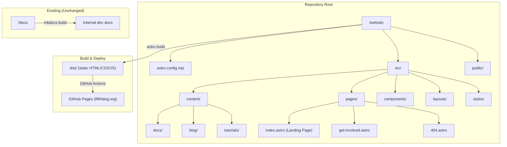

# Design Document: fifthlang-website

## Overview

This design specifies the architecture, technology choices, and implementation plan for the new fifthlang.org public website. The site replaces the current MkDocs-based documentation site with a purpose-built marketing and documentation portal that presents Fifth as a modern, compelling programming language with native knowledge graph capabilities.

The new site will be built with Astro, live under `/website` in the repository, deploy to GitHub Pages via GitHub Actions, and be maintained by a single developer. The existing `docs/` folder and MkDocs setup remain untouched for internal developer documentation.

### Goals

- Present Fifth with a strong first impression via a visually striking landing page
- Provide clear onboarding (installation → first program → language tour → knowledge graphs)
- Host comprehensive documentation, tutorials, and a blog
- Be trivially maintainable: Markdown-first authoring, minimal config, fast builds
- Deploy automatically on push to `master`

### SSG Evaluation Summary

After evaluating Hugo, Astro, and Eleventy (detailed below in Architecture), **Astro** is the recommended static site generator. It offers the best balance of Markdown-first authoring, component flexibility for the landing page, near-zero JS output by default, and a thriving ecosystem with active maintenance.

---

## Architecture

### Static Site Generator Evaluation

Requirement 10 mandates evaluating at least three SSG options. Below is a genuine comparison of the three strongest candidates for this project.

#### Option 1: Hugo

| Aspect | Details |
|--------|---------|
| Language | Go (single binary) |
| Version | v0.147+ (June 2025) |
| Build Speed | Fastest SSG available — sub-second builds for hundreds of pages |
| Markdown Support | Native, with shortcodes for custom components |
| Templating | Go `html/template` — powerful but idiosyncratic syntax |
| Content Model | File-based with front matter; built-in taxonomies, sections, archetypes |
| Ecosystem | Large theme library; active community; Hugo Modules for dependencies |
| Custom Layouts | Full support via `layouts/` directory with lookup order |
| Blog Support | Built-in with list/single templates, RSS generation, pagination |
| Syntax Highlighting | Built-in via Chroma (server-side, no JS) — custom languages via lexer config |
| Maintenance | Single Go binary, no Node.js dependency, no `node_modules` |
| GitHub Pages | Excellent — official GitHub Actions starter workflow available |

**Pros**: Blazing fast builds, zero runtime dependencies, mature content model, built-in RSS/sitemap/taxonomies. Single binary means no dependency management.

**Cons**: Go template syntax has a steep learning curve and is verbose for complex layouts. Building a custom, visually rich landing page requires fighting the template engine. Adding interactive components (dark mode toggle, search) requires manual JS wiring. Custom syntax highlighting for Fifth requires writing a Chroma lexer in a specific XML format.

#### Option 2: Astro

| Aspect | Details |
|--------|---------|
| Language | Node.js / TypeScript |
| Version | v5.x (2025, stable) |
| Build Speed | Fast — typically 2-10 seconds for sites this size |
| Markdown Support | First-class with MDX support; content collections with schema validation |
| Templating | `.astro` components (HTML-like with JS expressions) + any UI framework |
| Content Model | Content Collections with Zod schemas; type-safe frontmatter |
| Ecosystem | Growing integration catalog; official integrations for sitemap, RSS, MDX |
| Custom Layouts | Full flexibility — different layouts per content type via frontmatter |
| Blog Support | Via content collections; official blog starter template |
| Syntax Highlighting | Built-in via Shiki (server-side) — custom TextMate grammars supported |
| Maintenance | Requires Node.js; `package.json` + `node_modules` |
| GitHub Pages | Official deployment guide and GitHub Actions adapter |

**Pros**: "Islands architecture" ships zero JS by default — only hydrates interactive components. `.astro` component syntax is intuitive (basically HTML + JS). Content Collections provide type-safe Markdown with schema validation. Shiki supports custom TextMate grammars, making Fifth syntax highlighting straightforward (VS Code grammar format). Excellent flexibility for a rich landing page without pulling in a full SPA framework. Active development with frequent releases.

**Cons**: Requires Node.js ecosystem (`node_modules`, `package.json`). Newer than Hugo/Jekyll, though now mature at v5. Build speed is good but not Hugo-level.

#### Option 3: Eleventy (11ty)

| Aspect | Details |
|--------|---------|
| Language | Node.js / JavaScript |
| Version | v3.x (stable, 2024-2025) |
| Build Speed | Fast — comparable to Astro for small-to-medium sites |
| Markdown Support | Native via markdown-it; extensible with plugins |
| Templating | Multiple engines: Nunjucks, Liquid, JavaScript, WebC |
| Content Model | File-based with data cascade; global/directory/file-level data |
| Ecosystem | Smaller plugin ecosystem; community-driven |
| Custom Layouts | Full support via template chaining and directory data files |
| Blog Support | Manual setup via collections and pagination |
| Syntax Highlighting | Via Prism or Shiki plugin — custom languages possible |
| Maintenance | Requires Node.js; minimal dependencies compared to most Node tools |
| GitHub Pages | Works well; no official adapter but straightforward config |

**Pros**: Extremely flexible and unopinionated. Minimal abstraction — you control the HTML output directly. Lightweight dependency footprint for a Node tool. Multiple template languages give options. Strong data cascade model.

**Cons**: Unopinionated means more manual setup for common features (blog, RSS, sitemap, search). No built-in component model — building a rich landing page requires more manual HTML/CSS work. Smaller ecosystem means fewer ready-made integrations. Documentation is thorough but less polished than Astro's.

#### Recommendation: Astro

**Astro is the recommended SSG** for the following reasons:

1. **Landing page flexibility**: The `.astro` component model makes building a visually rich, branded landing page natural — no fighting a template engine. The hero section, feature cards, and code snippets can each be clean components.

2. **Zero JS by default**: Astro's islands architecture means the site ships no JavaScript unless explicitly opted in (e.g., for dark mode toggle, search). This directly supports Requirement 16 (performance, works without JS).

3. **Content Collections**: Type-safe Markdown with Zod schema validation catches frontmatter errors at build time. This is valuable for a single maintainer who wants guardrails.

4. **Fifth syntax highlighting**: Astro uses Shiki, which accepts TextMate grammar files — the same format used by VS Code extensions. A Fifth `.tmLanguage.json` can be maintained alongside the site and reused for the VS Code extension.

5. **Ecosystem**: Official integrations for sitemap, RSS, MDX, and image optimization cover Requirements 6.3 (RSS), 13.1 (sitemap), and 16 (performance).

6. **GitHub Pages**: Official deployment guide with a GitHub Actions workflow that fits within the 5-minute build constraint (Requirement 11.3).

7. **Single developer ergonomics**: `astro dev` provides hot-reload, content collections catch errors early, and the mental model (HTML components + Markdown content) is straightforward.

**Trade-off acknowledged**: Astro requires Node.js, adding `node_modules` to the project. This is mitigated by scoping everything under `/website` and adding `website/node_modules` to `.gitignore`. Hugo would avoid this entirely, but at the cost of template ergonomics for the landing page.

### High-Level Architecture



### Directory Structure

```
website/
├── astro.config.mjs          # Astro configuration
├── package.json               # Node dependencies
├── tsconfig.json              # TypeScript config
├── public/
│   ├── fifth-logo.svg         # Logo assets
│   ├── fifth-logo.shaded.svg
│   ├── favicon.svg
│   └── CNAME                  # GitHub Pages custom domain
├── src/
│   ├── content/
│   │   ├── config.ts          # Content collection schemas
│   │   ├── docs/              # Documentation Markdown files
│   │   │   ├── getting-started/
│   │   │   │   ├── installation.md
│   │   │   │   ├── first-program.md
│   │   │   │   └── language-tour.md
│   │   │   ├── language-reference/
│   │   │   ├── knowledge-graphs/
│   │   │   ├── sdk-reference/
│   │   │   └── compiler-cli/
│   │   ├── blog/              # Blog posts
│   │   │   ├── 2025-11-16-announcing-fifth.md
│   │   │   ├── 2025-11-28-release-packaging-pipeline.md
│   │   │   ├── 2025-12-05-the-story-of-fifth.md
│   │   │   └── 2025-09-16-graph-assertion-block.md
│   │   └── tutorials/         # Tutorial content
│   │       ├── learn-fifth-in-y-minutes.md
│   │       └── working-with-knowledge-graphs.md
│   ├── components/
│   │   ├── Header.astro       # Site header with nav
│   │   ├── Footer.astro       # Site footer
│   │   ├── Nav.astro          # Navigation (desktop + mobile)
│   │   ├── Breadcrumbs.astro  # Breadcrumb navigation
│   │   ├── CodeBlock.astro    # Enhanced code block with copy button
│   │   ├── FeatureCard.astro  # Landing page feature card
│   │   ├── HeroSection.astro  # Landing page hero
│   │   ├── SearchWidget.astro # Site search (Pagefind)
│   │   ├── ThemeToggle.astro  # Dark/light mode toggle
│   │   └── DocSidebar.astro   # Documentation sidebar nav
│   ├── layouts/
│   │   ├── BaseLayout.astro   # Root layout (head, meta, body)
│   │   ├── DocLayout.astro    # Documentation pages (sidebar + content)
│   │   ├── BlogLayout.astro   # Blog post layout
│   │   └── TutorialLayout.astro # Tutorial layout
│   ├── pages/
│   │   ├── index.astro        # Landing page
│   │   ├── get-involved.astro # Community/contribute page
│   │   ├── 404.astro          # Custom 404 page
│   │   ├── blog/
│   │   │   ├── index.astro    # Blog listing
│   │   │   ├── [...slug].astro # Blog post pages
│   │   │   └── rss.xml.ts     # RSS feed endpoint
│   │   ├── docs/
│   │   │   └── [...slug].astro # Documentation pages
│   │   └── tutorials/
│   │       ├── index.astro    # Tutorial listing
│   │       └── [...slug].astro # Tutorial pages
│   └── styles/
│       └── global.css         # Global styles, design tokens, Fifth theme
└── fifth.tmLanguage.json      # TextMate grammar for Fifth syntax highlighting
```

---

## Components and Interfaces

### Content Collections (Data Layer)

Astro Content Collections define the schema for each content type. This provides type-safe frontmatter validation at build time.

```typescript
// src/content/config.ts
import { defineCollection, z } from 'astro:content';

const docs = defineCollection({
  type: 'content',
  schema: z.object({
    title: z.string(),
    description: z.string().optional(),
    order: z.number().optional(),       // For sidebar ordering
    category: z.string().optional(),    // For sidebar grouping
  }),
});

const blog = defineCollection({
  type: 'content',
  schema: z.object({
    title: z.string(),
    date: z.date(),
    author: z.string().default('Andrew Matthews'),
    summary: z.string(),
    draft: z.boolean().default(false),
  }),
});

const tutorials = defineCollection({
  type: 'content',
  schema: z.object({
    title: z.string(),
    description: z.string().optional(),
    readingTime: z.string(),            // e.g., "15 min"
    prerequisites: z.array(z.string()).default([]),
    order: z.number().optional(),
    nextTutorial: z.string().optional(), // slug of next tutorial
  }),
});

export const collections = { docs, blog, tutorials };
```

### Layout Components

#### BaseLayout

The root layout wraps every page. Responsibilities:
- HTML `<head>` with meta tags, Open Graph, Twitter Card (Req 13.2)
- Semantic HTML structure: `<header>`, `<nav>`, `<main>`, `<footer>` (Req 13.3)
- Global CSS import with design tokens
- Conditional dark mode class on `<html>`
- Pagefind search index script (loaded async)

#### DocLayout

Extends BaseLayout for documentation pages:
- Left sidebar with collapsible category groups (Req 4.2)
- Maintains sidebar scroll position via `sessionStorage` (Req 4.3)
- Breadcrumb navigation (Req 2.2)
- Table of contents (right sidebar on wide viewports)
- Previous/Next page navigation

#### BlogLayout

Extends BaseLayout for blog posts:
- Publication date and estimated reading time display (Req 6.4)
- Author attribution
- Back-to-blog-list link

#### TutorialLayout

Extends BaseLayout for tutorials:
- Reading time and prerequisites display (Req 5.4)
- Next tutorial link (Req 5.3)
- Progress indicator

### UI Components

#### Header / Nav

- Persistent top-level menu: Home, Getting Started, Documentation, Tutorials, Blog, Get Involved (Req 2.1)
- Active section highlighting (Req 2.4)
- Responsive hamburger menu below 768px viewport (Req 2.3)
- Logo in header (Req 9.2)
- Dark mode toggle button
- Search trigger button

#### CodeBlock

- Wraps Astro's built-in Shiki highlighting
- Copy-to-clipboard button on all code blocks (Req 3.4, 8.2)
- Line numbers for blocks exceeding 20 lines (Req 8.3)
- Scrollable container for long blocks (Req 8.3)
- Loads custom Fifth TextMate grammar (Req 8.4)

#### HeroSection

- Tagline: "A systems programming language with native knowledge graphs" (Req 1.1)
- Short Fifth code snippet (3-6 lines) showing KG syntax (Req 1.4)
- Two CTAs: "Install Fifth" → installation guide, "Learn in Y Minutes" → tutorial (Req 1.3)

#### FeatureCard

- Icon/illustration + title + 1-2 sentence description + code snippet (Req 1.2)
- Three cards minimum: Imperative Programming, Knowledge Graphs, .NET Integration

#### SearchWidget

- Powered by Pagefind (static search, no server needed) (Req 2.5)
- Indexes all docs, tutorials, and blog content at build time
- Keyboard shortcut (Cmd/Ctrl+K) to open search modal

#### DocSidebar

- Grouped by category with collapsible sections (Req 4.2)
- Highlights current page
- Preserves scroll/expansion state via `sessionStorage` (Req 4.3)

### Search Implementation

**Pagefind** is the recommended search solution:
- Runs at build time, generates a static search index
- No server-side processing required (GitHub Pages compatible)
- Indexes all HTML output automatically
- Lightweight JS bundle (~6KB gzipped)
- Supports keyboard navigation and highlighting

### Syntax Highlighting for Fifth

A custom TextMate grammar (`fifth.tmLanguage.json`) will be created to highlight:
- Keywords: `main`, `return`, `if`, `else`, `while`, `class`, `extends`, `try`, `catch`, `finally`, `use`, `alias`, `new`, `with`, `from`, `where`, `in`
- Types: `int`, `float`, `string`, `bool`, `rune`, `graph`, `triple`, `store`, `query`, `result`
- Knowledge graph constructs: triple literals `<s, p, o>`, TriG blocks `@< >`, SPARQL literals `?<...>`, IRI prefixes
- Comments: `//` single-line, `/* */` multi-line
- Strings: `"..."`, `` `...` `` (raw), `$"..."` (interpolated)
- Operators: `+=`, `-=`, `<-`, `**`, standard arithmetic/comparison

This grammar is registered in `astro.config.mjs` via Shiki's `langs` option and can be reused for a future VS Code extension.

### Dark Mode

- CSS custom properties for all colors, toggled via a `data-theme="dark"` attribute on `<html>`
- Toggle button in header stores preference in `localStorage`
- Respects `prefers-color-scheme` media query as default
- Minimal JS: inline script in `<head>` to prevent flash of wrong theme (FOUC)

---

## Data Models

### Content Frontmatter Schemas

#### Documentation Page

```yaml
---
title: "Installation Guide"
description: "Download and install the Fifth compiler on Linux, macOS, and Windows"
category: "getting-started"    # Groups pages in sidebar
order: 1                       # Sort order within category
---
```

#### Blog Post

```yaml
---
title: "Announcing Fifth Language"
date: 2025-11-16
author: "Andrew Matthews"
summary: "Introducing Fifth — a .NET language with native knowledge graph support."
draft: false
---
```

#### Tutorial

```yaml
---
title: "Learn Fifth in Y Minutes"
description: "A rapid tour of Fifth syntax and features"
readingTime: "20 min"
prerequisites: []
order: 1
nextTutorial: "working-with-knowledge-graphs"
---
```

### Navigation Configuration

Sidebar navigation for the documentation section is driven by a combination of:
1. Directory structure under `src/content/docs/`
2. `category` and `order` frontmatter fields
3. A `nav.ts` config file for explicit ordering overrides

```typescript
// src/config/nav.ts
export const docCategories = [
  { slug: 'getting-started', label: 'Getting Started' },
  { slug: 'language-reference', label: 'Language Reference' },
  { slug: 'knowledge-graphs', label: 'Knowledge Graphs' },
  { slug: 'sdk-reference', label: 'SDK Reference' },
  { slug: 'compiler-cli', label: 'Compiler CLI' },
];
```

### Design Tokens (CSS Custom Properties)

```css
:root {
  /* Primary accent colors from Fifth logo */
  --color-accent-magenta: #FF0082;
  --color-accent-orange: #FE5B00;

  /* Derived palette */
  --color-accent-magenta-light: #FF4DA6;
  --color-accent-magenta-dark: #CC0068;
  --color-accent-orange-light: #FF8C40;
  --color-accent-orange-dark: #CC4900;

  /* Neutrals (light theme) */
  --color-bg-primary: #FFFFFF;
  --color-bg-secondary: #F8F9FA;
  --color-bg-code: #F1F3F5;
  --color-text-primary: #1A1A2E;
  --color-text-secondary: #4A4A6A;
  --color-text-muted: #8888A0;
  --color-border: #E2E4E8;

  /* Semantic */
  --color-link: var(--color-accent-magenta);
  --color-link-hover: var(--color-accent-magenta-dark);
  --color-cta-primary-bg: var(--color-accent-magenta);
  --color-cta-primary-text: #FFFFFF;
  --color-cta-secondary-bg: transparent;
  --color-cta-secondary-border: var(--color-accent-orange);
  --color-cta-secondary-text: var(--color-accent-orange);

  /* Typography */
  --font-sans: 'Inter', system-ui, -apple-system, sans-serif;
  --font-mono: 'JetBrains Mono', 'Fira Code', monospace;
  --font-size-base: 1rem;
  --line-height-base: 1.6;

  /* Spacing scale */
  --space-1: 0.25rem;
  --space-2: 0.5rem;
  --space-3: 0.75rem;
  --space-4: 1rem;
  --space-6: 1.5rem;
  --space-8: 2rem;
  --space-12: 3rem;
  --space-16: 4rem;
}

[data-theme="dark"] {
  --color-bg-primary: #0D1117;
  --color-bg-secondary: #161B22;
  --color-bg-code: #1C2128;
  --color-text-primary: #E6EDF3;
  --color-text-secondary: #B0B8C4;
  --color-text-muted: #7D8590;
  --color-border: #30363D;
}
```

### Astro Configuration

```javascript
// astro.config.mjs
import { defineConfig } from 'astro/config';
import mdx from '@astrojs/mdx';
import sitemap from '@astrojs/sitemap';

export default defineConfig({
  site: 'https://fifthlang.org',
  outDir: './dist',
  integrations: [mdx(), sitemap()],
  markdown: {
    shikiConfig: {
      themes: { light: 'github-light', dark: 'github-dark' },
      langs: [
        // Custom Fifth grammar loaded from file
        JSON.parse(fs.readFileSync('./fifth.tmLanguage.json', 'utf-8')),
      ],
    },
  },
});
```

### GitHub Actions Deployment Workflow

```yaml
# .github/workflows/deploy-website.yml
name: Deploy Website

on:
  push:
    branches: [master]
    paths: ['website/**']
  workflow_dispatch:

permissions:
  contents: read
  pages: write
  id-token: write

concurrency:
  group: pages
  cancel-in-progress: false

jobs:
  build:
    runs-on: ubuntu-latest
    defaults:
      run:
        working-directory: ./website
    steps:
      - uses: actions/checkout@v4
      - uses: actions/setup-node@v4
        with:
          node-version: 22
          cache: npm
          cache-dependency-path: website/package-lock.json
      - run: npm ci
      - run: npm run build
      - uses: actions/upload-pages-artifact@v3
        with:
          path: ./website/dist

  deploy:
    needs: build
    runs-on: ubuntu-latest
    environment:
      name: github-pages
      url: ${{ steps.deployment.outputs.page_url }}
    steps:
      - id: deployment
        uses: actions/deploy-pages@v4
```

### Content Migration Map

Based on Requirement 14, the following content migrates from `docs/` to `website/src/content/`:

| Source | Destination | Notes |
|--------|-------------|-------|
| `docs/Getting-Started/installation.md` | `content/docs/getting-started/installation.md` | Update links |
| `docs/Getting-Started/learn5thInYMinutes.md` | `content/tutorials/learn-fifth-in-y-minutes.md` | Add tutorial frontmatter |
| `docs/Getting-Started/knowledge-graphs.md` | `content/docs/knowledge-graphs/index.md` | Update links |
| `docs/Getting-Started/full-project-setup.md` | `content/docs/getting-started/project-setup.md` | Update links |
| `docs/Designs/fifth-sdk-readme.md` | `content/docs/sdk-reference/index.md` | Update links |
| `docs/Blog/*.md` (all 4 posts) | `content/blog/*.md` | Reformat frontmatter |
| `docs/index.md` (partial) | Landing page content | Extract relevant sections |

**Not migrated** (stays in `docs/` as internal dev docs):
- `docs/Development/*` — release process, repository summary, publishing
- `docs/Designs/` (except SDK readme) — internal design documents
- `docs/Planning/` — architecture review, roadmap issues
- `docs/Getting-Started/lsp-vscode-insiders.md` — developer tooling setup
- `docs/Getting-Started/quick-reference/` — can be linked but not migrated


---

## Correctness Properties

*A property is a characteristic or behavior that should hold true across all valid executions of a system — essentially, a formal statement about what the system should do. Properties serve as the bridge between human-readable specifications and machine-verifiable correctness guarantees.*

The following properties are derived from the acceptance criteria in the requirements document. Each property is universally quantified and suitable for property-based testing against the built site output.

### Property 1: Global navigation presence

*For any* page in the built site, the rendered HTML shall contain a `<nav>` element with links to all six top-level sections: Home, Getting Started, Documentation, Tutorials, Blog, and Get Involved.

**Validates: Requirements 2.1**

### Property 2: Breadcrumb presence on non-landing pages

*For any* page in the built site that is not the landing page (index), the rendered HTML shall contain a breadcrumb navigation element showing the page's position in the site hierarchy.

**Validates: Requirements 2.2**

### Property 3: Documentation heading anchors

*For any* heading element (`h1`–`h6`) in any documentation page, the rendered HTML shall include an `id` attribute that can be used as a URL anchor fragment.

**Validates: Requirements 4.4**

### Property 4: Tutorial metadata display

*For any* tutorial page in the built site, the rendered HTML shall display both an estimated reading time and a list of prerequisites (which may be empty).

**Validates: Requirements 5.3, 5.4**

### Property 5: Blog post display completeness

*For any* blog post in the built site, the rendered blog index entry shall include the post's title, publication date, author, and summary, and the blog index shall list posts in reverse chronological order. Additionally, each individual blog post page shall display the publication date and estimated reading time.

**Validates: Requirements 6.1, 6.4**

### Property 6: Fifth syntax highlighting token differentiation

*For any* code block in the built site that is tagged as Fifth language, the rendered HTML shall contain `<span>` elements with distinct CSS classes for at least three different token categories (e.g., keywords, types, strings, comments).

**Validates: Requirements 8.1**

### Property 7: Copy-to-clipboard on all code blocks

*For any* code block (`<pre><code>`) in any page of the built site, the rendered HTML shall include a copy-to-clipboard button element.

**Validates: Requirements 3.4, 8.2**

### Property 8: Long code block line numbers and scrolling

*For any* code block in the built site that contains more than 20 lines, the rendered HTML shall include visible line number elements and a scrollable container.

**Validates: Requirements 8.3**

### Property 9: Content collection schema validation

*For any* valid frontmatter object conforming to the expected fields for its content type (blog post with title/date/author/summary, documentation page with title, tutorial with title/readingTime/prerequisites), the Zod schema validation shall accept it without errors.

**Validates: Requirements 12.1, 12.2, 12.3**

### Property 10: Sitemap completeness

*For any* public page generated by the build, the `sitemap.xml` output shall contain a corresponding `<url>` entry with the page's full URL.

**Validates: Requirements 13.1**

### Property 11: Meta tag presence

*For any* page in the built site, the rendered HTML `<head>` shall contain a `<title>` element, a `<meta name="description">` tag, Open Graph meta tags (`og:title`, `og:description`), and Twitter Card meta tags (`twitter:card`, `twitter:title`).

**Validates: Requirements 13.2**

### Property 12: Semantic HTML structure

*For any* page in the built site, the rendered HTML shall contain `<header>`, `<nav>`, `<main>`, and `<footer>` elements.

**Validates: Requirements 13.3**

### Property 13: Clean URLs

*For any* URL in the built site's page set, the URL path shall not contain file extensions (e.g., `.html`) or unnecessary path segments.

**Validates: Requirements 13.4**

### Property 14: Internal link integrity

*For any* internal link (`<a href="...">`) in any page of the built site where the href points to a relative or same-origin path, the link target shall resolve to an existing page or anchor in the built output.

**Validates: Requirements 14.4**

### Property 15: Content readable without JavaScript

*For any* page in the built site, the raw HTML (before any JavaScript execution) shall contain the page's main textual content within the `<main>` element.

**Validates: Requirements 16.2**

### Property 16: No external CDN dependencies for critical resources

*For any* page in the built site, the rendered HTML shall not contain `<link rel="stylesheet">` or `<script>` tags referencing external CDN domains (e.g., `cdnjs.cloudflare.com`, `unpkg.com`, `cdn.jsdelivr.net`) for resources required for initial page rendering.

**Validates: Requirements 16.3**

---

## Error Handling

### Build-Time Errors

| Error | Handling | Source |
|-------|----------|--------|
| Invalid frontmatter | Astro Content Collections + Zod schema validation fails the build with a clear error message indicating which file and which field is invalid | Content authoring |
| Missing content file referenced in nav | Build warning; sidebar renders without the missing entry | Navigation config |
| Broken internal link | Detected by link-checking build plugin; reported as build warning (optionally error in CI) | Content authoring |
| Invalid Fifth TextMate grammar | Shiki fails to load custom language; build falls back to plain text rendering with a warning | Syntax highlighting |
| Missing image/asset | Astro reports missing asset at build time; build fails | Content authoring |

### Runtime Errors (Client-Side)

| Error | Handling | Source |
|-------|----------|--------|
| JavaScript disabled | Site functions fully — all content is static HTML. Search and dark mode toggle degrade gracefully (search hidden, light theme default) | Visitor browser |
| 404 / Page not found | Custom 404.astro page displays with navigation back to home and search option | Visitor navigation |
| Search index fails to load | Pagefind shows "Search unavailable" message; site remains fully functional | Network issue |
| Dark mode toggle fails | Falls back to light theme (CSS default); no broken layout | JS error |

### Deployment Errors

| Error | Handling | Source |
|-------|----------|--------|
| Build failure in CI | GitHub Actions job fails; deployment step is skipped; previous deployment remains live | CI pipeline |
| Node.js version mismatch | `package.json` `engines` field + `.nvmrc` file specify required Node version; CI uses `actions/setup-node` with pinned version | CI environment |
| CNAME misconfiguration | CNAME file in `public/` is committed to repo; GitHub Pages serves from configured domain | DNS/deployment |

---

## Testing Strategy

### Dual Testing Approach

This project uses both unit/example tests and property-based tests for comprehensive coverage:

- **Unit/example tests**: Verify specific pages, specific content, and edge cases (e.g., "the landing page has a hero section", "the 404 page exists", "the RSS feed is valid XML")
- **Property-based tests**: Verify universal properties across all pages/content (e.g., "every page has nav links", "every code block has a copy button", "every URL is clean")

Both approaches are complementary: unit tests catch concrete regressions on specific pages, while property tests ensure structural invariants hold across the entire site as content grows.

### Testing Framework

- **Test runner**: Vitest (fast, TypeScript-native, works well with Astro projects)
- **Property-based testing library**: fast-check (JavaScript/TypeScript PBT library)
- **HTML parsing**: cheerio (server-side HTML parsing for asserting on rendered output)
- **Build output testing**: Tests run against the `dist/` directory after `astro build`

### Property-Based Testing Configuration

- Each property test runs a minimum of **100 iterations**
- Each property test is tagged with a comment referencing its design document property
- Tag format: `// Feature: fifthlang-website, Property {number}: {property_text}`
- Properties that enumerate all pages use the full page set as the input domain
- Properties that test content schemas use fast-check arbitraries to generate random valid/invalid frontmatter

### Test Categories

#### Build Output Tests (Property-Based)

These tests run after `astro build` and inspect the `dist/` directory:

1. **Navigation properties** (Properties 1, 2): Parse every HTML file in `dist/`, verify nav and breadcrumb elements
2. **Code block properties** (Properties 6, 7, 8): Find all `<pre><code>` blocks across all pages, verify highlighting, copy buttons, and line numbers
3. **SEO properties** (Properties 10, 11, 12, 13): Parse every HTML file, verify meta tags, semantic elements, and sitemap entries
4. **Link integrity** (Property 14): Crawl all internal links across all pages, verify each resolves
5. **Performance properties** (Properties 15, 16): Verify content presence in raw HTML and absence of external CDN references

#### Schema Validation Tests (Property-Based)

6. **Content schema validation** (Property 9): Use fast-check to generate random frontmatter objects and verify Zod schema acceptance/rejection

#### Example/Unit Tests

7. **Landing page structure**: Verify hero section, feature cards, CTAs, code snippet
8. **Specific page existence**: Getting Started pages, documentation sections, tutorials, blog posts
9. **RSS feed**: Verify `rss.xml` is valid XML with correct entries
10. **404 page**: Verify custom 404 has home link and search
11. **Content migration**: Verify migrated content exists, internal dev docs are NOT present
12. **Build artifacts**: Verify `sitemap.xml`, `CNAME`, favicon exist in output
13. **Dark mode CSS**: Verify CSS custom properties for both light and dark themes
14. **Fifth TextMate grammar**: Verify grammar file is valid JSON with expected scopes

### Test Execution

Tests are run as part of the website build validation:

```bash
cd website
npm run build          # Build the site
npx vitest --run       # Run all tests (single execution, not watch mode)
```

CI integration: The `deploy-website.yml` workflow runs tests after build and before deployment. A test failure prevents deployment.
