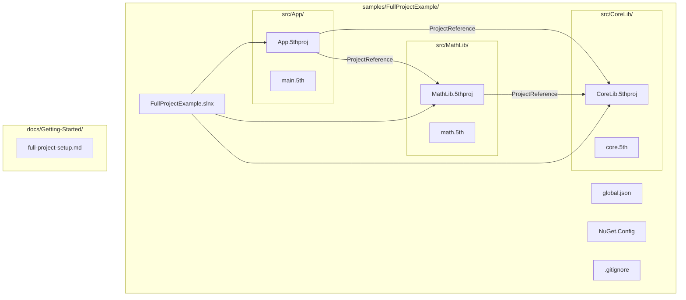

# Design Document: Full Project Example

## Overview

This feature creates a sample MSBuild solution at `samples/FullProjectExample/` that demonstrates multi-project Fifth language development. The sample uses the SLNX solution format (`.slnx`) and contains three `.5thproj` projects: one console application and two class libraries wired together via `ProjectReference`. An accompanying Getting Started guide at `docs/Getting-Started/full-project-setup.md` walks developers through the setup.

This is primarily a file-creation task. No new runtime code, SDK changes, or compiler modifications are needed. The deliverables are:

1. A set of project files, source files, and configuration files under `samples/FullProjectExample/`
2. A documentation page integrated into the mkdocs site

### Design Rationale

- **SLNX over .sln**: SLNX is the modern XML-based solution format from .NET 9 / VS 17.10+. It is human-readable and diff-friendly. No `.sln` files exist in the repo, so this sample establishes the pattern.
- **Two class libraries**: The minimum needed to demonstrate both direct and transitive `ProjectReference` chains through `ResolveFifthProjectReferences`.
- **Local SDK resolution**: The sample uses `global.json` to pin `Fifth.Sdk` version `0.7.1` from NuGet. No local pack step is needed.
- **Compiler as .NET tool**: The Fifth compiler is installed as a .NET tool (version 0.7.1) via a tool manifest. Each project sets `FifthCompilerCommand` to the tool command name instead of pointing to a local DLL path.

## Architecture

The sample is a self-contained directory under `samples/FullProjectExample/` with no dependencies outside the repository. The documentation page lives in `docs/Getting-Started/` and is registered in `mkdocs.yml`.



### Dependency Graph

```
App (Exe)
├── MathLib (Library)
│   └── CoreLib (Library)
└── CoreLib (Library)
```

- `App` depends on both `MathLib` and `CoreLib` (direct references).
- `MathLib` depends on `CoreLib` (demonstrates transitive dependency chain per Requirement 4.3).

## Components and Interfaces

This feature has no runtime components or APIs. It consists entirely of static files. The "components" are the file groups:

### 1. Solution and Configuration Files

| File | Purpose |
|------|---------|
| `samples/FullProjectExample/FullProjectExample.slnx` | SLNX solution listing all three projects |
| `samples/FullProjectExample/global.json` | Pins `Fifth.Sdk` version `0.7.1` via `msbuild-sdks` |
| `samples/FullProjectExample/.config/dotnet-tools.json` | .NET tool manifest pinning the Fifth compiler tool to version 0.7.1 |
| `samples/FullProjectExample/.gitignore` | Excludes `bin/`, `obj/`, `.vs/`, `*.user` |

### 2. Project Files (`.5thproj`)

Each project file uses `<Project Sdk="Fifth.Sdk">` and sets:
- `OutputType` (Exe or Library)
- `TargetFramework` (net8.0)
- `FifthCompilerCommand` (the .NET tool command name, e.g. `fifthc`)
- `ProjectReference` elements where applicable

| Project | Path | OutputType | References |
|---------|------|-----------|------------|
| App | `src/App/App.5thproj` | Exe | MathLib, CoreLib |
| MathLib | `src/MathLib/MathLib.5thproj` | Library | CoreLib |
| CoreLib | `src/CoreLib/CoreLib.5thproj` | Library | (none) |

### 3. Fifth Source Files (`.5th`)

Minimal source files demonstrating the build pipeline:

| File | Contents |
|------|----------|
| `src/App/main.5th` | `main(): void` entry point that calls `square()` from CoreLib and `add()` from MathLib |
| `src/MathLib/math.5th` | Exports an `add(a: int, b: int): int` function |
| `src/CoreLib/core.5th` | Exports a `square(x: int): int` function |

### 4. Documentation

| File | Purpose |
|------|---------|
| `docs/Getting-Started/full-project-setup.md` | Step-by-step guide for setting up a multi-project Fifth solution |
| `mkdocs.yml` | Updated nav to include the new guide under Getting Started |

## Data Models

No data models are introduced. All files are static configuration and source files. The relevant schemas are:

### SLNX Format

Because `.5thproj` is a custom project extension, each `<Project>` element requires an explicit `Type` attribute with the C# project type GUID so the SLNX parser can handle it:

```xml
<Solution>
  <Project Path="src/App/App.5thproj" Type="{FAE04EC0-301F-11D3-BF4B-00C04F79EFBC}" />
  <Project Path="src/MathLib/MathLib.5thproj" Type="{FAE04EC0-301F-11D3-BF4B-00C04F79EFBC}" />
  <Project Path="src/CoreLib/CoreLib.5thproj" Type="{FAE04EC0-301F-11D3-BF4B-00C04F79EFBC}" />
</Solution>
```

### .5thproj Format (Console App Example)

```xml
<Project Sdk="Fifth.Sdk">
  <PropertyGroup>
    <OutputType>Exe</OutputType>
    <TargetFramework>net8.0</TargetFramework>
    <FifthCompilerCommand>fifthc</FifthCompilerCommand>
  </PropertyGroup>
  <ItemGroup>
    <ProjectReference Include="..\MathLib\MathLib.5thproj" />
    <ProjectReference Include="..\CoreLib\CoreLib.5thproj" />
  </ItemGroup>
</Project>
```

### .5thproj Format (Class Library Example)

```xml
<Project Sdk="Fifth.Sdk">
  <PropertyGroup>
    <OutputType>Library</OutputType>
    <TargetFramework>net8.0</TargetFramework>
    <FifthCompilerCommand>fifthc</FifthCompilerCommand>
  </PropertyGroup>
</Project>
```

### global.json for Sample

```json
{
  "msbuild-sdks": {
    "Fifth.Sdk": "0.7.1"
  }
}
```

### NuGet.Config for Sample

```xml
<?xml version="1.0" encoding="utf-8"?>
<configuration>
  <packageSources>
    <clear />
    <add key="nuget.org" value="https://api.nuget.org/v3/index.json" protocolVersion="3" />
  </packageSources>
</configuration>
```

### .NET Tool Manifest for Sample

Located at `samples/FullProjectExample/.config/dotnet-tools.json`:

```json
{
  "version": 1,
  "isRoot": true,
  "tools": {
    "fifthc": {
      "version": "0.7.1",
      "commands": [
        "fifthc"
      ]
    }
  }
}
```


## Correctness Properties

*A property is a characteristic or behavior that should hold true across all valid executions of a system — essentially, a formal statement about what the system should do. Properties serve as the bridge between human-readable specifications and machine-verifiable correctness guarantees.*

Most acceptance criteria for this feature are concrete example checks (file exists at path X, file contains value Y) rather than universally quantified properties. This is expected for a file-creation task. The properties below capture the rules that apply across all files of a given type.

### Property 1: Project files declare required MSBuild properties

*For any* `.5thproj` file in the sample, it SHALL declare `TargetFramework` as `net8.0`, `FifthCompilerCommand` as the .NET tool command name, and `OutputType` matching its role (Exe for the console app, Library for class libraries).

**Validates: Requirements 3.2, 5.4**

### Property 2: Fifth source files are syntactically valid

*For any* `.5th` source file in the sample, the Fifth compiler's parser SHALL accept it without syntax errors.

**Validates: Requirements 6.1**

### Property 3: Library source files export functions

*For any* class library `.5th` source file in the sample, it SHALL contain at least one function definition.

**Validates: Requirements 6.3**

## Error Handling

This feature creates static files and documentation. There are no runtime error paths to design. The relevant error scenarios are:

1. **Compiler tool not installed**: If the Fifth compiler .NET tool is not installed, the `FifthCompilerCommand` will fail with a standard "command not found" error. The Getting Started guide addresses this by listing `dotnet tool restore` as a prerequisite step.

2. **SDK not resolved**: If `Fifth.Sdk` version `0.7.1` is not available from NuGet, `dotnet build` will fail with a NuGet resolution error. The Getting Started guide notes that the SDK is published on NuGet and resolved automatically via `global.json`.

3. **Missing ProjectReference target**: If a referenced `.5thproj` file doesn't exist, the `ResolveFifthProjectReferences` target emits: *"Missing project references: ..."*. The sample's relative paths are correct by construction.

4. **Wrong Visual Studio version**: SLNX requires VS 17.10+. The documentation notes this requirement. Older VS versions will fail to open the `.slnx` file.

No new error handling code is needed. All error paths are covered by existing SDK targets.

## Testing Strategy

### Dual Testing Approach

This feature is a file-creation task, so testing focuses on validating the created artifacts rather than exercising runtime code paths.

**Unit tests (example-based):**
- Verify each file exists at its required path
- Parse `.5thproj` files as XML and assert required properties
- Parse `FullProjectExample.slnx` as XML and assert all projects are listed
- Parse `NuGet.Config` as XML and assert `local-sdk` source and mapping
- Parse `global.json` as JSON and assert `msbuild-sdks` contains `Fifth.Sdk: 0.7.1`
- Verify `.config/dotnet-tools.json` pins the compiler tool to version `0.7.1`
- Verify `.gitignore` contains `bin/`, `obj/`, `.vs/`, `*.user`
- Verify `mkdocs.yml` nav includes the new guide entry
- Verify documentation contains required sections (prerequisites, SLNX explanation, build steps, VS workflow)

**Property tests (property-based):**
- Property 1: Iterate all `.5thproj` files in the sample and verify required MSBuild properties
- Property 2: Iterate all `.5th` files and verify they parse without errors (requires compiler)
- Property 3: Iterate all library `.5th` files and verify they contain function definitions

**Property-Based Testing Configuration:**
- Library: FsCheck (via FsCheck.Xunit) or xUnit `[Theory]` with `[MemberData]` for data-driven iteration over the file set
- Since the input domain is a fixed set of files (not randomly generated), standard parameterized tests with `[Theory]`/`[MemberData]` are the pragmatic choice
- Each property test must run against all files in the sample (minimum 100 iterations is not applicable here since the domain is finite and small)
- Tag format: **Feature: full-project-example, Property {number}: {property_text}**

**Integration test (manual or CI):**
- Restore the .NET tool: `dotnet tool restore`
- Build the sample: `dotnet build samples/FullProjectExample/FullProjectExample.slnx`
- Verify build succeeds with no errors
