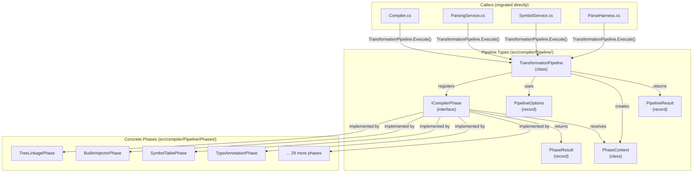
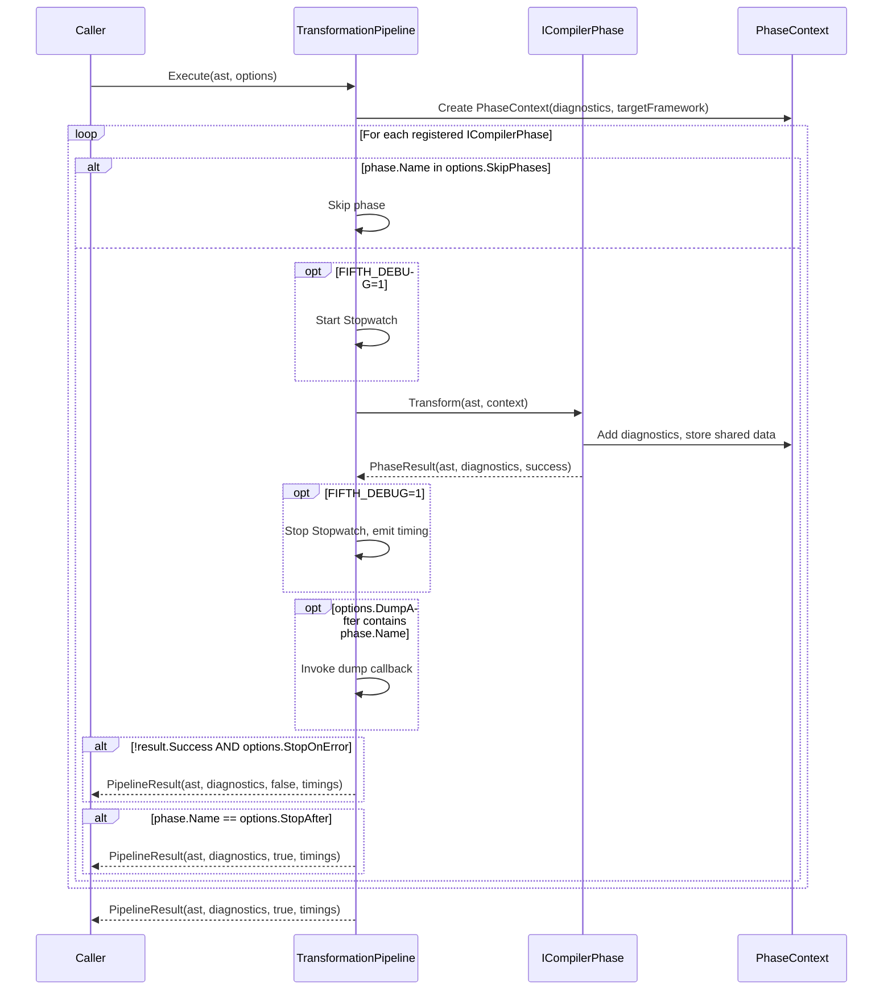

# Design Document: Composable Pipeline Architecture

## Overview

This design replaces the monolithic `FifthParserManager.ApplyLanguageAnalysisPhases` method — currently ~450 lines of 33 sequential `if (upTo >= AnalysisPhase.X)` blocks — with a composable pipeline architecture where each compiler phase is a class implementing `ICompilerPhase`, orchestrated by a `TransformationPipeline`.

### The Problem Today

Adding or reordering a compiler phase means editing a single enormous method, carefully inserting code at the right position among 33 conditional blocks with varying error handling patterns, compound sub-steps, and early-exit checkpoints. Phase dependencies are implicit (order-based), testing requires running the full pipeline, and there's no way to skip phases, dump intermediate ASTs, or profile individual phases without manual instrumentation.

### How the New System Works

The new architecture separates concerns into four layers:

1. **Phase interface** (`ICompilerPhase`): Each phase is a class with explicit metadata — name, dependencies, capabilities — and a `Transform` method that takes an AST and a `PhaseContext`, returning a structured `PhaseResult`.

2. **Shared context** (`PhaseContext`): A context object flows through all phases carrying diagnostics, target framework, and extensible shared data (symbol tables, type registries). This replaces the current approach of threading individual parameters through lambdas.

3. **Structured results** (`PhaseResult`): Each phase returns `(TransformedAst, Diagnostics, Success)` instead of returning null-for-error. The pipeline can make informed decisions about whether to continue.

4. **Pipeline orchestrator** (`TransformationPipeline`): Manages registration (with dependency validation), execution (with skip/stop-after/stop-on-error), timing, and AST dump hooks. A `CreateDefault()` factory builds the standard Fifth pipeline.

### Advantages Over the Current System

1. **Self-documenting phases**: Each phase class declares its name, what it depends on, and what it provides. A developer can inspect any phase in isolation to understand its role.

2. **Independent testability**: Phases can be tested by constructing a minimal pipeline with only the phase under test and its declared dependencies. No need to run 20 preceding phases to test phase 21.

3. **Structured error handling**: `PhaseResult.Success` replaces the null-return convention. Callers get explicit diagnostics and can decide how to proceed. The pipeline's `StopOnError` option controls whether to halt or continue collecting diagnostics.

4. **Flexible execution**: `PipelineOptions` replaces the `AnalysisPhase upTo` enum with string-based `StopAfter`, plus `SkipPhases` for selectively disabling phases. This is more expressive than the current "run everything up to phase N" model.

5. **Per-phase profiling**: The pipeline instruments every phase uniformly. `FIFTH_DEBUG=1` gives a complete phase-by-phase timing breakdown. `PipelineResult.PhaseTimings` makes timing available programmatically for LSP and tooling.

6. **AST debugging**: `DumpAfter` lets developers inspect the AST state after any phase without modifying pipeline code. Useful for bisecting which phase introduced a bug.

7. **Dependency validation at registration time**: If a phase declares a dependency on `"Symbols"` but no earlier phase provides it, the pipeline fails fast at registration — not at runtime with a cryptic null reference.

8. **Foundation for future work**: The explicit dependency graph enables future parallel execution of independent phases and phase-level caching for incremental compilation, without further architectural changes.

### Use Cases Enabled

- **Phase-level profiling**: `FIFTH_DEBUG=1` emits `[PHASE] TypeAnnotation completed in 42ms` for every phase, plus a pipeline total.
- **LSP-optimised partial pipelines**: The LSP server can create a pipeline with `StopAfter = "SymbolTableFinal"` for symbol resolution, skipping codegen-oriented phases.
- **Test isolation**: Tests can create a `TransformationPipeline` with only `TreeLinkagePhase` + `SymbolTablePhase` + the phase under test.
- **AST debugging**: `DumpAfter = { "SymbolTableFinal", "TypeAnnotation" }` dumps the AST at two key points for inspection.
- **Phase skipping**: `SkipPhases = { "TailCallOptimization" }` disables experimental phases without code changes.
- **Future plugin phases**: Third-party phases can implement `ICompilerPhase` and be registered in a custom pipeline.

## Architecture

The design introduces several new types, primarily in a new `src/compiler/Pipeline/` directory within the compiler project:



### Execution Flow



### Design Decisions

1. **Flat registration order, not topological sort**: The current pipeline has a strict linear order. While phases declare dependencies for validation and future parallel execution, the execution order is determined by registration order (which matches the current enum order). Topological sorting would be premature — the pipeline IS fundamentally linear today.

2. **Phase classes, not lambdas**: ISSUE-005 calls for proper classes implementing `ICompilerPhase` rather than the REM-008 approach of lambda delegates in records. Classes are more testable, more inspectable, and support compound phase logic more naturally than closures.

3. **String-based phase names, not enum**: `PipelineOptions.StopAfter` and `SkipPhases` use string phase names. The `AnalysisPhase` enum is retained for backward compatibility in the shim but is not part of the new API. String names are more extensible (third-party phases don't need enum values).

4. **PhaseContext replaces parameter threading**: Instead of passing `(ast, diagnostics, targetFramework, upTo)` through every delegate, a `PhaseContext` carries all shared state. This is cleaner and extensible — adding a new shared concern doesn't change the `Transform` signature.

5. **PhaseResult replaces null returns**: The current convention of returning `null` to signal errors is fragile. `PhaseResult.Success` makes the contract explicit. The backward-compatible shim translates `Success = false` back to `null` for legacy callers.

6. **No backward-compatible shim**: Since all callers are migrated directly, there's no `[Obsolete]` shim. The monolithic `ApplyLanguageAnalysisPhases` method and the `AnalysisPhase` enum are deleted outright. Less code, no confusion.

7. **Single compiler project**: All new types live in `src/compiler/Pipeline/`. No new projects are needed. The types are public so tests and the language server can access them.

## Components and Interfaces

### ICompilerPhase Interface

```csharp
namespace compiler.Pipeline;

/// <summary>
/// Interface for a single compiler analysis/transformation phase.
/// Each phase declares its dependencies and capabilities, enabling
/// dependency validation and future parallel execution.
/// </summary>
public interface ICompilerPhase
{
    /// <summary>Unique human-readable name for this phase.</summary>
    string Name { get; }
    
    /// <summary>
    /// Capability strings that must be provided by earlier phases.
    /// Empty if this phase has no dependencies.
    /// </summary>
    IReadOnlyList<string> DependsOn { get; }
    
    /// <summary>
    /// Capability strings that this phase provides to subsequent phases.
    /// </summary>
    IReadOnlyList<string> ProvidedCapabilities { get; }
    
    /// <summary>
    /// Execute this phase's transformation on the AST.
    /// </summary>
    PhaseResult Transform(AstThing ast, PhaseContext context);
}
```

### PhaseResult Record

```csharp
namespace compiler.Pipeline;

/// <summary>
/// Structured result from a phase execution, replacing the null-return convention.
/// </summary>
public record PhaseResult(
    AstThing TransformedAst,
    IReadOnlyList<Diagnostic> Diagnostics,
    bool Success
)
{
    /// <summary>Create a successful result with no diagnostics.</summary>
    public static PhaseResult Ok(AstThing ast) =>
        new(ast, Array.Empty<Diagnostic>(), true);
    
    /// <summary>Create a successful result with diagnostics.</summary>
    public static PhaseResult Ok(AstThing ast, IReadOnlyList<Diagnostic> diagnostics) =>
        new(ast, diagnostics, true);
    
    /// <summary>Create a failure result.</summary>
    public static PhaseResult Fail(AstThing ast, IReadOnlyList<Diagnostic> diagnostics) =>
        new(ast, diagnostics, false);
}
```

### PhaseContext Class

```csharp
namespace compiler.Pipeline;

/// <summary>
/// Shared context passed through all pipeline phases.
/// Carries diagnostics, configuration, and extensible shared data.
/// </summary>
public class PhaseContext
{
    /// <summary>Accumulated diagnostics from all phases.</summary>
    public List<Diagnostic> Diagnostics { get; } = new();
    
    /// <summary>Target framework for external call validation.</summary>
    public string? TargetFramework { get; init; }
    
    /// <summary>
    /// Extensible shared data dictionary for inter-phase communication.
    /// Phases store symbol tables, type registries, etc. using well-known keys.
    /// </summary>
    public Dictionary<string, object> SharedData { get; } = new();
    
    /// <summary>Whether phase-level caching is enabled (future use).</summary>
    public bool EnableCaching { get; init; }
}
```

### PipelineOptions Record

```csharp
namespace compiler.Pipeline;

/// <summary>
/// Configuration for pipeline execution.
/// </summary>
public record PipelineOptions
{
    /// <summary>Phase names to skip during execution.</summary>
    public HashSet<string> SkipPhases { get; init; } = new();
    
    /// <summary>Stop execution after this phase (inclusive). Null = run all.</summary>
    public string? StopAfter { get; init; }
    
    /// <summary>Stop on first phase failure. Default true.</summary>
    public bool StopOnError { get; init; } = true;
    
    /// <summary>Enable phase-level caching (future use). Default false.</summary>
    public bool EnableCaching { get; init; }
    
    /// <summary>Phase names after which to dump AST state.</summary>
    public HashSet<string>? DumpAfter { get; init; }
    
    /// <summary>Callback invoked for AST dumps. Receives (ast, phaseName).</summary>
    public Action<AstThing, string>? DumpCallback { get; init; }
    
    /// <summary>Default options: run all phases, stop on error.</summary>
    public static PipelineOptions Default { get; } = new();
}
```

### PipelineResult Record

```csharp
namespace compiler.Pipeline;

/// <summary>
/// Result of a complete pipeline execution.
/// </summary>
public record PipelineResult(
    AstThing? TransformedAst,
    IReadOnlyList<Diagnostic> Diagnostics,
    bool Success,
    IReadOnlyDictionary<string, TimeSpan> PhaseTimings
);
```

### TransformationPipeline Class

```csharp
namespace compiler.Pipeline;

/// <summary>
/// Orchestrates compiler phase registration, dependency validation, and execution.
/// </summary>
public class TransformationPipeline
{
    private readonly List<ICompilerPhase> _phases = new();
    private readonly HashSet<string> _availableCapabilities = new();
    
    /// <summary>Registered phases in execution order.</summary>
    public IReadOnlyList<ICompilerPhase> Phases => _phases.AsReadOnly();
    
    /// <summary>
    /// Register a phase. Validates that all declared dependencies are satisfied
    /// by capabilities provided by previously registered phases.
    /// </summary>
    public void RegisterPhase(ICompilerPhase phase)
    {
        foreach (var dep in phase.DependsOn)
        {
            if (!_availableCapabilities.Contains(dep))
                throw new InvalidOperationException(
                    $"Phase '{phase.Name}' depends on capability '{dep}' " +
                    $"which is not provided by any previously registered phase.");
        }
        _phases.Add(phase);
        foreach (var cap in phase.ProvidedCapabilities)
            _availableCapabilities.Add(cap);
    }
    
    /// <summary>
    /// Execute the pipeline on an AST with the given options.
    /// </summary>
    public PipelineResult Execute(AstThing ast, PipelineOptions? options = null)
    {
        ArgumentNullException.ThrowIfNull(ast);
        options ??= PipelineOptions.Default;
        
        var context = new PhaseContext
        {
            TargetFramework = /* from caller */,
            EnableCaching = options.EnableCaching
        };
        
        var timings = new Dictionary<string, TimeSpan>();
        var totalSw = DebugHelpers.DebugEnabled ? Stopwatch.StartNew() : null;
        var currentAst = ast;
        var phaseCount = 0;
        
        foreach (var phase in _phases)
        {
            if (options.SkipPhases.Contains(phase.Name))
                continue;
            
            var phaseSw = Stopwatch.StartNew();
            var result = phase.Transform(currentAst, context);
            phaseSw.Stop();
            
            timings[phase.Name] = phaseSw.Elapsed;
            context.Diagnostics.AddRange(result.Diagnostics);
            phaseCount++;
            
            if (DebugHelpers.DebugEnabled)
                Console.Error.WriteLine(
                    $"[PHASE] {phase.Name} completed in {phaseSw.ElapsedMilliseconds}ms");
            
            if (options.DumpAfter?.Contains(phase.Name) == true)
                (options.DumpCallback ?? DefaultDump)(result.TransformedAst, phase.Name);
            
            if (!result.Success && options.StopOnError)
            {
                EmitTotalTiming(totalSw, phaseCount);
                return new PipelineResult(
                    result.TransformedAst, context.Diagnostics.AsReadOnly(),
                    false, timings);
            }
            
            currentAst = result.TransformedAst;
            
            if (phase.Name == options.StopAfter)
                break;
        }
        
        EmitTotalTiming(totalSw, phaseCount);
        return new PipelineResult(
            currentAst, context.Diagnostics.AsReadOnly(), true, timings);
    }
    
    /// <summary>
    /// Create the default Fifth compiler pipeline with all standard phases.
    /// </summary>
    public static TransformationPipeline CreateDefault()
    {
        var pipeline = new TransformationPipeline();
        // Register all 33 phases in order...
        pipeline.RegisterPhase(new TreeLinkagePhase());
        pipeline.RegisterPhase(new BuiltinInjectorPhase());
        pipeline.RegisterPhase(new ClassCtorsPhase());
        // ... etc for all phases
        return pipeline;
    }
    
    /// <summary>
    /// Query which capabilities are available after a given phase.
    /// </summary>
    public IReadOnlySet<string> GetCapabilitiesAfter(string phaseName)
    {
        var caps = new HashSet<string>();
        foreach (var phase in _phases)
        {
            foreach (var cap in phase.ProvidedCapabilities)
                caps.Add(cap);
            if (phase.Name == phaseName)
                break;
        }
        return caps;
    }
    
    private static void DefaultDump(AstThing ast, string phaseName) =>
        DebugHelpers.DebugLog($"[DUMP after {phaseName}] AST: {ast}");
    
    private static void EmitTotalTiming(Stopwatch? sw, int count)
    {
        if (sw != null && DebugHelpers.DebugEnabled)
        {
            sw.Stop();
            Console.Error.WriteLine(
                $"[PIPELINE] Total: {sw.ElapsedMilliseconds}ms ({count} phases executed)");
        }
    }
}
```

### Example Concrete Phase: TreeLinkagePhase

```csharp
namespace compiler.Pipeline.Phases;

public class TreeLinkagePhase : ICompilerPhase
{
    public string Name => "TreeLinkage";
    public IReadOnlyList<string> DependsOn => Array.Empty<string>();
    public IReadOnlyList<string> ProvidedCapabilities => new[] { "TreeStructure" };
    
    public PhaseResult Transform(AstThing ast, PhaseContext context)
    {
        try
        {
            var result = new TreeLinkageVisitor().Visit(ast);
            return PhaseResult.Ok(result);
        }
        catch (Exception ex)
        {
            // Preserve the specialised TreeLink error handling
            if (DebugHelpers.DebugEnabled)
            {
                DebugHelpers.DebugLog($"TreeLinkageVisitor failed with: {ex.Message}");
                DebugHelpers.DebugLog($"Stack trace: {ex.StackTrace}");
            }
            context.Diagnostics.Add(new Diagnostic(
                DiagnosticLevel.Error,
                $"TreeLinkageVisitor failed: {ex.Message}\nStack: {ex.StackTrace}"));
            throw;
        }
    }
}
```

### Example Concrete Phase: TypeAnnotationPhase (Compound)

```csharp
namespace compiler.Pipeline.Phases;

/// <summary>
/// Compound phase that runs type annotation, symbol table rebuild,
/// augmented assignment lowering, type error collection, and
/// graph triple operator lowering with re-annotation.
/// </summary>
public class TypeAnnotationPhase : ICompilerPhase
{
    public string Name => "TypeAnnotation";
    public IReadOnlyList<string> DependsOn => new[] { "Symbols", "VarRefs" };
    public IReadOnlyList<string> ProvidedCapabilities => new[] { "Types" };
    
    public PhaseResult Transform(AstThing ast, PhaseContext context)
    {
        var diagnostics = new List<Diagnostic>();
        var typeAnnotationVisitor = new TypeAnnotationVisitor();
        
        ast = typeAnnotationVisitor.Visit(ast);
        ast = new SymbolTableBuilderVisitor().Visit(ast);
        
        // Augmented assignment lowering (always runs in the new pipeline
        // since compound phase sub-steps are no longer upTo-gated)
        ast = new AugmentedAssignmentLoweringRewriter().Visit(ast);
        
        // Collect type errors
        foreach (var error in typeAnnotationVisitor.Errors
            .Where(e => e.Severity == TypeCheckingSeverity.Error))
        {
            diagnostics.Add(new Diagnostic(
                DiagnosticLevel.Error,
                $"{error.Message} at {error.Filename}:{error.Line}:{error.Column}",
                error.Filename, "TYPE_ERROR"));
        }
        
        if (diagnostics.Any(d => d.Level == DiagnosticLevel.Error))
            return PhaseResult.Fail(ast, diagnostics);
        
        // Graph triple operator lowering with re-link/re-annotation
        ast = (AstThing)new TripleGraphAdditionLoweringRewriter().Rewrite(ast).Node;
        ast = new TreeLinkageVisitor().Visit(ast);
        ast = new SymbolTableBuilderVisitor().Visit(ast);
        ast = new VarRefResolverVisitor().Visit(ast);
        var typeAnnotationVisitor2 = new TypeAnnotationVisitor();
        ast = typeAnnotationVisitor2.Visit(ast);
        ast = new SymbolTableBuilderVisitor().Visit(ast);
        
        foreach (var error in typeAnnotationVisitor2.Errors
            .Where(e => e.Severity == TypeCheckingSeverity.Error))
        {
            diagnostics.Add(new Diagnostic(
                DiagnosticLevel.Error,
                $"{error.Message} at {error.Filename}:{error.Line}:{error.Column}",
                error.Filename, "TYPE_ERROR"));
        }
        
        if (diagnostics.Any(d => d.Level == DiagnosticLevel.Error))
            return PhaseResult.Fail(ast, diagnostics);
        
        return PhaseResult.Ok(ast, diagnostics);
    }
}
```

### Caller Migration Examples

**Compiler.cs** (before → after):
```csharp
// Before:
var transformed = FifthParserManager.ApplyLanguageAnalysisPhases(
    ast, diagnostics, targetFramework: targetFramework);

// After:
var pipeline = TransformationPipeline.CreateDefault();
var result = pipeline.Execute(ast, PipelineOptions.Default, targetFramework);
diagnostics.AddRange(result.Diagnostics);
var transformed = result.Success ? result.TransformedAst : null;
```

**ParseHarness.cs** (before → after):
```csharp
// Before:
processed = FifthParserManager.ApplyLanguageAnalysisPhases(
    ast, diagnostics: phaseDiagnostics, upTo: options.Phase) as AssemblyDef;

// After:
var pipeline = TransformationPipeline.CreateDefault();
var pipelineOptions = new PipelineOptions
{
    StopAfter = options.PhaseName // string-based, e.g. "TypeAnnotation"
};
var result = pipeline.Execute(ast, pipelineOptions);
phaseDiagnostics.AddRange(result.Diagnostics);
processed = result.Success ? result.TransformedAst as AssemblyDef : null;
```

### Legacy Code Removal

After all callers are migrated, the following are deleted from `ParserManager.cs`:
- The `AnalysisPhase` enum (replaced by string-based phase names)
- The `ApplyLanguageAnalysisPhases` method (replaced by `TransformationPipeline.Execute`)
- The `ExecutePhase` helper method (error handling now lives in each phase's `Transform` method)

### Interaction Between Components

The `TransformationPipeline` is the central orchestrator. It owns the list of `ICompilerPhase` instances and the execution loop. Each phase receives a `PhaseContext` (created by the pipeline) and returns a `PhaseResult`. The pipeline aggregates diagnostics from all `PhaseResult`s into the `PhaseContext`, then returns a `PipelineResult` to the caller.

The `ExecutePhase` helper method from the current implementation is preserved as a utility that phase classes can use internally for standard error handling. Phases with custom error handling (TreeLinkage, PropertyToField) implement their own try/catch in `Transform`.

### Default Phase Registration Order

The `CreateDefault()` factory registers phases in this order, matching the current `AnalysisPhase` enum:

| # | Phase Name | DependsOn | Provides | Compound? |
|---|-----------|-----------|----------|-----------|
| 1 | TreeLinkage | — | TreeStructure | No |
| 2 | BuiltinInjector | TreeStructure | Builtins | No |
| 3 | ClassCtors | TreeStructure | ClassConstructors | Yes (inserter + relink) |
| 4 | ConstructorValidation | ClassConstructors | — | No |
| 5 | SymbolTableInitial | TreeStructure, Builtins | Symbols | No |
| 6 | NamespaceImportResolver | Symbols | NamespaceImports | No |
| 7 | ConstructorResolution | Symbols | ResolvedConstructors | No |
| 8 | DefiniteAssignment | ResolvedConstructors | — | No |
| 9 | BaseConstructorValidation | ResolvedConstructors | — | No |
| 10 | TypeParameterResolution | Symbols | TypeParameters | No |
| 11 | GenericTypeInference | TypeParameters | GenericTypes | No |
| 12 | PropertyToField | TreeStructure | FieldExpansion | No |
| 13 | DestructurePatternFlatten | FieldExpansion | Destructuring | Yes (visitor + propagator) |
| 14 | OverloadGathering | Destructuring | OverloadGroups | No |
| 15 | GuardValidation | OverloadGroups | GuardChecks | No |
| 16 | OverloadTransform | GuardChecks | OverloadTransforms | No |
| 17 | DestructuringLowering | OverloadTransforms | DestructuringLowered | No |
| 18 | UnaryOperatorLowering | DestructuringLowered | UnaryLowered | No |
| 19 | SparqlVariableBinding | Symbols | SparqlBindings | No |
| 20 | SparqlLiteralLowering | SparqlBindings | SparqlLowered | No |
| 21 | TriGLiteralLowering | SparqlLowered | TriGLowered | No |
| 22 | TreeRelink | TriGLowered | TreeRelinked | No |
| 23 | TripleDiagnostics | TreeRelinked | TripleDiags | No |
| 24 | TripleExpansion | TripleDiags | TripleExpanded | No |
| 25 | SymbolTableFinal | TripleExpanded | SymbolsFinal | No |
| 26 | NamespaceImportResolverFinal | SymbolsFinal | — | No |
| 27 | VarRefResolver | SymbolsFinal | VarRefs | No |
| 28 | TypeAnnotation | Symbols, VarRefs | Types | Yes (complex compound) |
| 29 | ExternalCallValidation | Types | — | No |
| 30 | TryCatchFinallyValidation | Types | — | No |
| 31 | QueryApplicationTypeCheck | Types | QueryTypes | No |
| 32 | QueryApplicationLowering | QueryTypes | QueryLowered | No |
| 33 | ListComprehensionValidation | Types | — | No |
| 34 | ListComprehensionLowering | Types | ComprehensionLowered | No |
| 35 | LambdaValidation | Types | — | No |
| 36 | LambdaClosureConversion | Types | ClosureConverted | Yes (validation + conversion + relink) |
| 37 | Defunctionalisation | ClosureConverted | Defunctionalised | Yes (rewrite + relink) |
| 38 | TailCallOptimization | Defunctionalised | — | No (disabled/skipped) |

Note: The numbering here exceeds 33 because some current `AnalysisPhase` enum values map to multiple logical steps (e.g., SymbolTableInitial triggers both symbol table building and namespace import resolution). The phase count in the new system reflects the actual number of distinct operations.

## Data Models

### ICompilerPhase Interface

| Member | Type | Description |
|--------|------|-------------|
| `Name` | `string` | Unique identifier. Used in `PipelineOptions.StopAfter`, `SkipPhases`, timing output, and error messages. |
| `DependsOn` | `IReadOnlyList<string>` | Capability strings required from earlier phases. Validated at registration time. |
| `ProvidedCapabilities` | `IReadOnlyList<string>` | Capability strings this phase provides. Added to the pipeline's capability set after registration. |
| `Transform(AstThing, PhaseContext)` | `PhaseResult` | The transformation method. Receives current AST and shared context, returns structured result. |

### PhaseResult Record

| Field | Type | Description |
|-------|------|-------------|
| `TransformedAst` | `AstThing` | The AST after this phase's transformation. |
| `Diagnostics` | `IReadOnlyList<Diagnostic>` | Diagnostics produced by this phase (errors, warnings, info). |
| `Success` | `bool` | Whether the phase completed without errors. `false` triggers `StopOnError` in the pipeline. |

### PhaseContext Class

| Field | Type | Description |
|-------|------|-------------|
| `Diagnostics` | `List<Diagnostic>` | Accumulated diagnostics from all phases. |
| `TargetFramework` | `string?` | Target framework string for external call validation. |
| `SharedData` | `Dictionary<string, object>` | Extensible inter-phase data (symbol tables, type registries, etc.). |
| `EnableCaching` | `bool` | Whether phase-level caching is enabled (future use). |

### PipelineOptions Record

| Field | Type | Default | Description |
|-------|------|---------|-------------|
| `SkipPhases` | `HashSet<string>` | empty | Phase names to skip. |
| `StopAfter` | `string?` | null | Stop after this phase (inclusive). Null = run all. |
| `StopOnError` | `bool` | true | Halt on first phase failure. |
| `EnableCaching` | `bool` | false | Enable phase-level caching (future). |
| `DumpAfter` | `HashSet<string>?` | null | Phases after which to dump AST. |
| `DumpCallback` | `Action<AstThing, string>?` | null | Custom dump handler. |

### PipelineResult Record

| Field | Type | Description |
|-------|------|-------------|
| `TransformedAst` | `AstThing?` | Final AST after pipeline execution. Null if pipeline failed before producing output. |
| `Diagnostics` | `IReadOnlyList<Diagnostic>` | All diagnostics from all executed phases. |
| `Success` | `bool` | Whether the pipeline completed successfully. |
| `PhaseTimings` | `IReadOnlyDictionary<string, TimeSpan>` | Per-phase execution times. Always populated (not just in debug mode). |

### AnalysisPhase Enum (Deleted)

The existing `AnalysisPhase` enum is deleted along with the monolithic `ApplyLanguageAnalysisPhases` method. All callers are migrated to use string-based phase names via `PipelineOptions.StopAfter`. The `ParseOptions.Phase` property in test harnesses is updated to use `string? PhaseName` instead.

## Correctness Properties

*A property is a characteristic or behavior that should hold true across all valid executions of a system — essentially, a formal statement about what the system should do. Properties serve as the bridge between human-readable specifications and machine-verifiable correctness guarantees.*

### Property 1: Default pipeline structural integrity

*For any* default pipeline created via `CreateDefault()`, all phase names SHALL be unique, all declared dependencies SHALL be satisfied by capabilities provided by earlier phases, and the phase count SHALL match the expected number of phases.

**Validates: Requirements 1.2, 6.1, 7.1, 17.1, 17.2, 17.3, 17.4**

### Property 2: Dependency validation rejects unsatisfied dependencies

*For any* `ICompilerPhase` whose `DependsOn` contains a capability string not provided by any previously registered phase, calling `RegisterPhase` SHALL throw `InvalidOperationException`. Conversely, *for any* phase whose `DependsOn` is empty or fully satisfied, `RegisterPhase` SHALL succeed.

**Validates: Requirements 4.2, 7.1, 7.2, 7.3, 7.4**

### Property 3: Phase execution respects registration order

*For any* `TransformationPipeline` with N registered phases and default `PipelineOptions`, the `Transform` methods SHALL be invoked in exactly the order the phases were registered (phase 1 before phase 2 before ... before phase N).

**Validates: Requirements 4.3, 11.2**

### Property 4: SkipPhases excludes named phases from execution

*For any* `TransformationPipeline` and *for any* subset of phase names in `PipelineOptions.SkipPhases`, those phases SHALL not have their `Transform` method invoked, while all other phases SHALL execute in order.

**Validates: Requirements 5.2, 9.1**

### Property 5: StopAfter halts execution at the named phase

*For any* `TransformationPipeline` and *for any* valid phase name set as `PipelineOptions.StopAfter`, the pipeline SHALL execute phases up to and including the named phase, and SHALL not execute any phases after it.

**Validates: Requirements 5.3, 9.2**

### Property 6: StopOnError halts execution on phase failure

*For any* `TransformationPipeline` where phase N returns `PhaseResult.Success = false` and `PipelineOptions.StopOnError = true`, phases N+1 through the end SHALL not execute, and the `PipelineResult.Success` SHALL be `false`.

**Validates: Requirements 5.4, 2.2, 2.3**

### Property 7: Diagnostics accumulation across phases

*For any* pipeline execution, the `PipelineResult.Diagnostics` SHALL contain exactly the union of all `PhaseResult.Diagnostics` from all executed phases, in execution order.

**Validates: Requirements 3.4, 4.4**

### Property 8: Options forwarding to PhaseContext

*For any* `targetFramework` string (including null) and *for any* `EnableCaching` boolean value, the `PhaseContext` received by each phase SHALL have `TargetFramework` equal to the caller-provided value and `EnableCaching` equal to `PipelineOptions.EnableCaching`.

**Validates: Requirements 3.5, 18.1, 18.3**

### Property 9: PhaseTimings populated for all executed phases

*For any* pipeline execution, `PipelineResult.PhaseTimings` SHALL contain an entry for every phase that was executed (not skipped), and each timing value SHALL be non-negative.

**Validates: Requirements 8.1, 8.5**

### Property 10: Debug timing output format

*For any* executed phase, when `DebugHelpers.DebugEnabled` is true, the pipeline SHALL emit a line to stderr matching `[PHASE] <Name> completed in <N>ms`. When `DebugHelpers.DebugEnabled` is false, no such output SHALL be emitted.

**Validates: Requirements 8.2, 8.4**

### Property 11: DumpAfter invokes callback with correct arguments

*For any* phase name in `PipelineOptions.DumpAfter`, the dump callback SHALL be invoked exactly once after that phase completes, receiving the phase's output AST and the phase name as arguments.

**Validates: Requirements 5.5, 10.1**

### Property 12: Phases property exposes all registered phases

*For any* `TransformationPipeline` with N registered phases, the `Phases` property SHALL return a list of exactly N elements in registration order, regardless of `PipelineOptions` settings.

**Validates: Requirements 4.6, 15.1, 15.2**

### Property 13: GetCapabilitiesAfter returns cumulative capabilities

*For any* phase name in the pipeline, `GetCapabilitiesAfter(phaseName)` SHALL return the union of `ProvidedCapabilities` from all phases up to and including the named phase.

**Validates: Requirements 15.4**

### Property 14: Pipeline behavioral equivalence

*For any* valid Fifth source program that the current monolithic `ApplyLanguageAnalysisPhases` processes successfully, the new `TransformationPipeline.CreateDefault().Execute()` SHALL produce an identical AST and identical diagnostics.

**Validates: Requirements 6.4, 14.1, 14.2, 14.3, 14.4, 14.5**

### Property 15: Exception handling preserves phase context

*For any* phase whose `Transform` method throws an exception, the pipeline SHALL ensure the exception is catchable by the caller and that the phase name is identifiable from the error context (either in the exception message or in a diagnostic added before re-throwing).

**Validates: Requirements 13.1**

## Error Handling

### Phase Execution Errors

The error handling strategy preserves the three distinct patterns that exist in the current implementation, now encapsulated within each phase's `Transform` method:

1. **Standard phases (majority)**: The phase's `Transform` method wraps its visitor/rewriter call in a try/catch. On exception:
   - The exception type, message, and stack trace are logged to `Console.Error`
   - A `Diagnostic` with `DiagnosticLevel.Error` is added to `PhaseContext.Diagnostics`
   - If `DebugHelpers.DebugEnabled`, additional debug logging via `DebugHelpers.DebugLog`
   - The exception is re-thrown (the pipeline catches it and returns a failed `PipelineResult`)

2. **TreeLinkage phase**: Specialised try/catch within `TreeLinkagePhase.Transform` that:
   - Logs to `DebugHelpers.DebugLog` (if enabled) with message and stack trace
   - Adds an error diagnostic with the full message and stack trace
   - Re-throws the original exception (not wrapped)

3. **PropertyToField phase**: Specialised try/catch within `PropertyToFieldPhase.Transform` that:
   - Logs to `DebugHelpers.DebugLog` (if enabled) with message and stack trace
   - Re-throws the original exception (not wrapped)
   - Does NOT add to diagnostics

### Pipeline-Level Exception Handling

The `TransformationPipeline.Execute` method wraps each phase invocation in a try/catch:
- If a phase throws, the pipeline catches the exception
- If `StopOnError` is true (default), the pipeline returns a failed `PipelineResult` with accumulated diagnostics
- If `StopOnError` is false, the pipeline logs the error and continues to the next phase
- The exception is always available in the `PipelineResult` diagnostics

### Early Exit Behaviour

The new system replaces the null-return convention with `PhaseResult.Success = false`:
- Phases that detect errors return `PhaseResult.Fail(ast, diagnostics)` instead of returning null
- The pipeline checks `result.Success` after each phase
- When `StopOnError` is true and a phase fails, the pipeline stops and returns `PipelineResult.Success = false`

### Diagnostics-Conditional Phases

The ExternalCallValidation and TryCatchFinallyValidation phases check whether diagnostics collection is active (via a flag on `PhaseContext` or by checking if the caller wants diagnostics). When diagnostics collection is not active, these phases return `PhaseResult.Ok(ast)` without running their validation visitors, matching the current `if (diagnostics != null)` guard.

## Testing Strategy

### Dual Testing Approach

This feature requires both unit tests and property-based tests:

- **Property-based tests**: Verify universal properties of the pipeline structure and execution behaviour across all possible inputs (phase configurations, options combinations, error conditions).
- **Unit tests**: Verify specific examples, edge cases, integration with the existing compiler, and behavioral equivalence with the current monolithic method.

### Property-Based Testing Configuration

- **Library**: [FsCheck](https://fscheck.github.io/FsCheck/) (well-established PBT library for .NET/C#, compatible with xUnit)
- **Minimum iterations**: 100 per property test
- **Tag format**: `Feature: pipeline-phase-registry, Property {N}: {property_text}`

Each correctness property from the design document maps to a single property-based test.

### Property Tests

| Property | Test Description | Generator Strategy |
|----------|-----------------|-------------------|
| P1: Default pipeline structural integrity | Create default pipeline, verify unique names, satisfied deps, expected count | Single execution against `CreateDefault()` |
| P2: Dependency validation rejects unsatisfied deps | Generate random phases with random DependsOn strings, register in random order, verify throws when deps unsatisfied | Random capability strings, random phase orderings |
| P3: Phase execution respects registration order | Register N mock phases, execute, verify invocation order matches registration | Random number of mock phases (2-20) |
| P4: SkipPhases excludes named phases | Register N mock phases, generate random skip subsets, verify skipped phases don't execute | Random subsets of phase names |
| P5: StopAfter halts at named phase | Register N mock phases, pick random StopAfter, verify only phases up to that point execute | Random phase index for StopAfter |
| P6: StopOnError halts on failure | Register N mock phases, make random phase fail, verify subsequent phases don't execute | Random failure index |
| P7: Diagnostics accumulation | Register N mock phases each producing random diagnostics, verify union in result | Random diagnostic lists per phase |
| P8: Options forwarding to PhaseContext | Generate random targetFramework strings and EnableCaching bools, verify PhaseContext values | Random strings and booleans |
| P9: PhaseTimings populated | Execute pipeline, verify timing entries exist for all executed phases with non-negative values | Random phase counts |
| P10: Debug timing output format | Execute with debug enabled/disabled, capture stderr, verify format presence/absence | Random phase counts, toggle debug |
| P11: DumpAfter invokes callback | Register N phases, set random DumpAfter subset, verify callback invoked with correct args | Random DumpAfter subsets |
| P12: Phases property exposes all | Register N phases, verify Phases.Count == N and order matches | Random phase counts |
| P13: GetCapabilitiesAfter cumulative | Register phases with random capabilities, verify cumulative set at each point | Random capability strings |
| P14: Pipeline behavioral equivalence | Parse valid Fifth programs, run both old and new pipeline, compare AST and diagnostics | Corpus of valid Fifth source files |
| P15: Exception handling preserves context | Register mock phase that throws, verify exception is catchable and phase name identifiable | Random exception messages |

### Unit Tests

| Test | Description |
|------|-------------|
| ICompilerPhase interface exists | Verify the interface compiles and has expected members |
| PhaseResult.Ok factory | Verify Ok creates Success=true result |
| PhaseResult.Fail factory | Verify Fail creates Success=false result |
| PhaseContext construction | Verify default values and property setting |
| PipelineOptions.Default | Verify default options values |
| CreateDefault phase count | Verify expected number of phases registered |
| CreateDefault includes TreeLinkage | Verify first phase is TreeLinkage |
| CreateDefault includes TypeAnnotation | Verify TypeAnnotation phase exists |
| TailCallOptimization is skipped | Verify it's in default SkipPhases or not registered |
| ExternalCallValidation exists | Verify phase exists in default pipeline |
| TreeLinkage specialised error handling | Verify TreeLinkagePhase catches and re-throws with diagnostics |
| PropertyToField specialised error handling | Verify PropertyToFieldPhase catches and re-throws without diagnostics |
| Compound phase: ClassCtors | Verify ClassCtorsPhase runs inserter + relink |
| Compound phase: TypeAnnotation | Verify TypeAnnotationPhase runs full compound logic |
| Existing test suite passes | All existing tests pass with the new pipeline (regression gate) |

### Test Organisation

- Property tests and unit tests for the pipeline go in a new test file within `test/ast-tests/` (e.g., `PipelineTests.cs` or `Pipeline/TransformationPipelineTests.cs`)
- The existing test suite serves as the integration/regression gate — all existing tests must pass with the new pipeline
- No new test project is needed; the existing `ast-tests` project already references the compiler project
- Behavioral equivalence tests (P15) use the existing `.5th` test corpus to verify the new pipeline produces identical results to the old monolithic method
