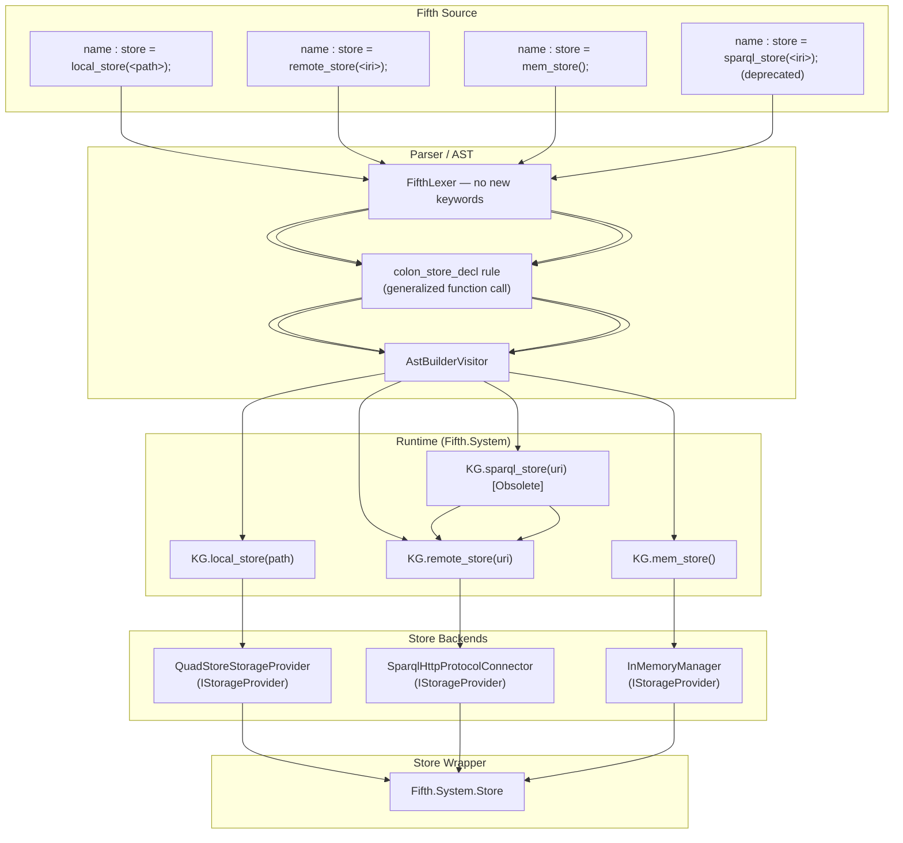

# Design Document: QuadStore Default Store

## Overview

This design replaces the default RDF storage backend in the Fifth language runtime with the `aabs/QuadStore` package. The change touches four layers of the system:

1. **NuGet dependencies** — `QuadStore.Core` and `QuadStore.SparqlServer` are added to `Fifth.System.csproj` and propagated transitively to compiled Fifth programs via the SDK.
2. **Runtime API** — `KG.CreateStore()` switches from dotNetRDF `InMemoryManager` to a QuadStore-backed store. Three new `[BuiltinFunction]` methods (`remote_store`, `local_store`, `mem_store`) replace the single `sparql_store`. A new `Store.CreateFileStore(string path)` factory method is added.
3. **Grammar & parser** — `FifthParser.g4`'s `colon_store_decl` rule is generalised to accept any function call expression on the right-hand side, rather than being hardcoded to specific keywords. No new lexer keywords are added — `remote_store`, `local_store`, and `mem_store` are regular function identifiers resolved at runtime via `Fifth.System.KG`.
4. **Deprecation** — `sparql_store` is marked `[Obsolete]` and delegates to `remote_store`. The grammar continues to accept it during the transition period, and the compiler emits a deprecation warning.

The integration strategy is adapter-based: `QuadStoreStorageProvider` implements dotNetRDF's `IStorageProvider`, so the existing `Store` class wraps it without any public API changes. Known limitation: `DeleteGraph` and triple retraction throw `NotImplementedException` on QuadStore-backed stores.

## Architecture



The compiler pipeline is unchanged. `QueryApplicationTypeCheckRewriter`, `QueryApplicationLoweringRewriter`, and `TriGLiteralLoweringRewriter` continue to operate on the same AST shapes. The `QueryApplicationExecutor` already works against `Store.GetTripleStore()`, which QuadStore-backed stores will need to support (see Components section).

## Components and Interfaces

### 1. NuGet Package References (`Fifth.System.csproj`)

Add two new `<PackageReference>` entries:

```xml
<PackageReference Include="QuadStore.Core" Version="*" />
<PackageReference Include="QuadStore.SparqlServer" Version="*" />
```

These sit alongside the existing `dotNetRdf` reference. The Fifth SDK project file must propagate these as transitive dependencies so compiled Fifth programs resolve them at runtime.

### 2. `Store` Class Additions (`Store.cs`)

No changes to the existing public API. One new factory method:

```csharp
/// <summary>
/// Creates a persistent store backed by QuadStore at the given file system path.
/// </summary>
public static Store CreateFileStore(string path)
{
    if (string.IsNullOrEmpty(path))
        throw new ArgumentException("Store path cannot be null or empty", nameof(path));

    // QuadStoreStorageProvider implements IStorageProvider
    var provider = new QuadStoreStorageProvider(path);
    return new Store(provider);
}
```

Design decision: `CreateFileStore` does not accept a `TripleStore` parameter because QuadStore manages its own persistence. The `_tripleStore` field remains `null` for file-backed stores. This means `QueryApplicationExecutor` needs an alternative query path for QuadStore-backed stores (see section 5).

`Store.CreateInMemory()` remains unchanged — it continues to use dotNetRDF's `InMemoryManager`.

### 3. `KG` Class — New Built-in Functions (`KnowledgeGraphs.cs`)

Three new `[BuiltinFunction]` methods plus deprecation of the existing one:

```csharp
[BuiltinFunction]
public static Store remote_store(string endpointUri)
{
    return Store.CreateSparqlStore(endpointUri);
}

[BuiltinFunction]
public static Store local_store(string path)
{
    return Store.CreateFileStore(path);
}

[BuiltinFunction]
public static Store mem_store()
{
    return Store.CreateInMemory();
}

[BuiltinFunction]
[Obsolete("Use remote_store, local_store, or mem_store instead")]
public static Store sparql_store(string endpointUri)
{
    return remote_store(endpointUri);
}
```

`KG.CreateStore()` changes from returning `InMemoryManager` to returning a QuadStore-backed store. This is the "default store" semantic shift:

```csharp
[BuiltinFunction]
public static Store CreateStore()
{
    // Default store is now QuadStore-backed (temp directory)
    var tempPath = Path.Combine(Path.GetTempPath(), "fifth-quadstore-" + Guid.NewGuid().ToString("N"));
    return Store.CreateFileStore(tempPath);
}
```

Design decision: `CreateStore()` uses a temp directory so it remains a zero-argument call. Programs that need persistence should use `local_store(path)` explicitly.

### 4. Lexer & Parser Changes

#### FifthLexer.g4

No new keyword tokens are added. The existing `SPARQL` token for `sparql_store` is retained for backward compatibility during the deprecation period. `remote_store`, `local_store`, and `mem_store` are regular identifiers — they are resolved as function calls at the runtime level, not as language keywords.

#### FifthParser.g4

Generalise `colon_store_decl` to accept any function call expression on the right-hand side, rather than being hardcoded to `SPARQL`:

```antlr
colon_store_decl:
    store_name = IDENTIFIER COLON STORE ASSIGN store_creation_expr SEMI;

store_creation_expr:
    SPARQL L_PAREN iri R_PAREN                                          # store_sparql
  | func_name = IDENTIFIER L_PAREN (expressionList)? R_PAREN           # store_func_call;
```

Design decision: The `store_sparql` alternative is kept for backward compatibility with the existing `sparql_store` keyword token. The new `store_func_call` alternative accepts any identifier as a function name, allowing `remote_store(...)`, `local_store(...)`, `mem_store()`, or any future store creation function to be used without grammar changes. The function name is resolved at the runtime level via `Fifth.System.KG`.

`local_store` accepts a string literal argument (for file paths like `"/data/my-store"`). `mem_store` takes no arguments. `remote_store` accepts a string or IRI argument.

The default store declaration form (`store default = ...`) already works because the parser treats `default` as an `IDENTIFIER` (the `DEFAULT` keyword is only special in `switch`/`case` contexts, and the lexer rule for `DEFAULT` is separate from `IDENTIFIER`). The existing grammar already handles `store default = sparql_store(<iri>);` — the generalised `store_creation_expr` extends this to any function call.

#### AstBuilderVisitor

`VisitColon_store_decl` is updated to dispatch on the `store_creation_expr` alternative:

- `store_sparql` → emit `KG.sparql_store(uri)` call (with deprecation warning diagnostic)
- `store_func_call` → emit a function call to the named function with the provided arguments, resolved at runtime

Each produces a `VarDeclStatement` with `Kind = "StoreDecl"` annotation, same as today.

### 5. Query Execution Compatibility

`QueryApplicationExecutor.Execute` currently requires `store.GetTripleStore() != null` (in-memory stores only). For QuadStore-backed stores, `GetTripleStore()` returns `null`.

Two options:
- **Option A**: QuadStore exposes a SPARQL query endpoint via `QuadStore.SparqlServer`. The executor can send the query over HTTP to a local endpoint.
- **Option B**: QuadStore provides an in-process query API that returns a `TripleStore`-compatible object.

Design decision: Use Option A. `Store.CreateFileStore` starts a lightweight local SPARQL server (from `QuadStore.SparqlServer`) and the executor falls back to HTTP-based query execution when `GetTripleStore()` is null. This keeps the `Store` class unchanged and leverages the existing `SparqlHttpProtocolConnector` path.

Alternatively, if QuadStore exposes an `IQueryableStorage` interface, the executor can use `IQueryableStorage.Query()` directly. The implementation will check for this interface first before falling back to the HTTP path.

### 6. Deprecation Warning Emission

The compiler should emit a deprecation warning when `sparql_store` is used. This can be done in `AstBuilderVisitor.VisitColon_store_decl` by adding a diagnostic when the `store_sparql` alternative is matched (the `SPARQL` keyword token is still recognized by the lexer):

```csharp
diagnostics?.Add(new Diagnostic(
    DiagnosticLevel.Warning,
    "sparql_store is deprecated. Use remote_store, local_store, or mem_store instead.",
    location,
    "STORE_DEPRECATED_001"
));
```

## Data Models

### Store Backend Taxonomy

| Function | Backend | Persistence | Locality | IStorageProvider |
|---|---|---|---|---|
| `remote_store(uri)` | SPARQL endpoint | Remote-managed | Remote | `SparqlHttpProtocolConnector` |
| `local_store(path)` | QuadStore | Persistent (disk) | Local | `QuadStoreStorageProvider` |
| `mem_store()` | dotNetRDF | Transient (RAM) | Local | `InMemoryManager` |
| `sparql_store(uri)` | (delegates to `remote_store`) | — | — | — |

### Store Class Internal State

```csharp
public sealed class Store
{
    private readonly IStorageProvider _inner;        // Always set
    private readonly TripleStore? _tripleStore;      // Non-null only for InMemoryManager stores
    // No new fields needed — QuadStore integrates via IStorageProvider
}
```

### Grammar AST Output

All four store creation forms produce the same AST shape:

```
VarDeclStatement
├── VariableDecl { Name = "<store_name>", TypeName = "Store" }
├── InitialValue = MemberAccessExp
│   ├── LHS = VarRefExp { VarName = "KG" }
│   └── RHS = FuncCallExp { FunctionName = "<function_name>", Args = [...] }
└── Annotations = { "Kind" = "StoreDecl" }
```

### Diagnostic Codes

| Code | Severity | Description |
|---|---|---|
| `STORE_DEPRECATED_001` | Warning | `sparql_store` is deprecated; use `remote_store`, `local_store`, or `mem_store` |


## Correctness Properties

*A property is a characteristic or behavior that should hold true across all valid executions of a system — essentially, a formal statement about what the system should do. Properties serve as the bridge between human-readable specifications and machine-verifiable correctness guarantees.*

### Property 1: Save/Load round-trip on QuadStore-backed stores

*For any* valid RDF graph with an assigned URI and any set of triples, saving that graph to a QuadStore-backed store and then loading it back by the same URI should produce a graph containing exactly the same set of triples.

**Validates: Requirements 2.2, 2.3, 8.2, 8.3**

### Property 2: Persistence round-trip across store instances

*For any* valid file system path, any RDF graph with an assigned URI, and any set of triples: saving the graph to a QuadStore-backed store at that path, closing the store, then reopening a new store at the same path and loading the graph by URI should produce a graph containing exactly the same set of triples.

**Validates: Requirements 3.1, 3.2, 4.5**

### Property 3: Parser produces correct AST for all store creation functions

*For any* store creation function in {`remote_store`, `local_store`, `mem_store`, `sparql_store`}, parsing a valid store declaration using that function should produce a `VarDeclStatement` with a `Kind = "StoreDecl"` annotation. Functions are resolved as regular identifiers (not keywords) except for the deprecated `sparql_store` which uses the existing `SPARQL` keyword token.

**Validates: Requirements 5.3**

### Property 4: Query result type matches query form on QuadStore-backed stores

*For any* SPARQL query executed against a QuadStore-backed store containing data, the result type should match the query form: SELECT queries produce `Result.TabularResult`, ASK queries produce `Result.BooleanResult`, and CONSTRUCT queries produce `Result.GraphResult`.

**Validates: Requirements 7.1, 7.2, 7.3, 7.4**

### Property 5: TriG literal loading produces functional store

*For any* valid TriG content string, `Store.LoadFromTriG(trigContent)` should produce a store from which all named graphs present in the TriG content can be loaded, and each loaded graph should contain the triples specified in the TriG content for that graph.

**Validates: Requirements 6.5, 9.5**

## Error Handling

### ArgumentException — Invalid Paths and URIs

- `Store.CreateFileStore(null)` and `Store.CreateFileStore("")` throw `ArgumentException`.
- `KG.local_store(null)` and `KG.local_store("")` throw `ArgumentException` (delegates to `CreateFileStore`).
- `KG.remote_store(null)` and `KG.remote_store("")` throw `ArgumentException` (delegates to `CreateSparqlStore`).

### IOException — Permission Errors

- `Store.CreateFileStore(path)` where `path` is inaccessible throws `IOException` with a descriptive message. This is surfaced from the underlying `QuadStoreStorageProvider` constructor.

### NotImplementedException — QuadStore Limitations

- `Store.DeleteGraph(uri)` on a QuadStore-backed store throws `NotImplementedException`.
- `Store.RemoveGraphInPlace(graph)` on a QuadStore-backed store throws `NotImplementedException`.
- The `Store` `-` operator on a QuadStore-backed store throws `NotImplementedException` (via `CloneForImmutableOperations` or `DeleteGraph`).
- The `Store` `+` operator on a QuadStore-backed store throws `InvalidOperationException` from `CloneForImmutableOperations` because `_tripleStore` is null. This is an accepted limitation — immutable store operators are only supported for in-memory stores.

### Deprecation Warning

- Using `sparql_store` in a store declaration emits diagnostic `STORE_DEPRECATED_001` (Warning level). The program still compiles and runs correctly.

### Query Execution Errors

- `QueryApplicationExecutor.Execute` against a QuadStore-backed store where `GetTripleStore()` returns null currently throws `NotSupportedException`. This needs to be updated to support QuadStore query execution (see Architecture section, component 5).

## Testing Strategy

### Unit Tests (xUnit + FluentAssertions)

Unit tests cover specific examples, edge cases, and error conditions:

- `Store.CreateFileStore` with valid path creates a store (example)
- `Store.CreateFileStore` with null/empty path throws `ArgumentException` (edge case)
- `Store.CreateFileStore` with inaccessible path throws `IOException` (edge case)
- `KG.remote_store` returns a Store wrapping `SparqlHttpProtocolConnector` (example)
- `KG.local_store` returns a Store wrapping `QuadStoreStorageProvider` (example)
- `KG.mem_store` returns a Store wrapping `InMemoryManager` (example)
- `KG.sparql_store` delegates to `remote_store` (example)
- `KG.sparql_store` has `[Obsolete]` attribute (example via reflection)
- `KG.CreateStore()` returns a QuadStore-backed store (example)
- `Store.CreateInMemory()` still returns InMemoryManager-backed store (regression)
- `DeleteGraph` on QuadStore-backed store throws `NotImplementedException` (edge case)
- `RemoveGraphInPlace` on QuadStore-backed store throws `NotImplementedException` (edge case)
- Parser accepts `name : store = remote_store(<http://example.com/>);` (example)
- Parser accepts `name : store = local_store("/data/store");` (example)
- Parser accepts `name : store = mem_store();` (example)
- Parser accepts `store default = local_store("/data/store");` (example)
- Parser accepts `store default = remote_store(<http://example.com/>);` (example)
- Parser accepts `store default = mem_store();` (example)
- Parser still accepts `name : store = sparql_store(<http://example.com/>);` (regression)
- Compiler emits `STORE_DEPRECATED_001` warning for `sparql_store` usage (example)
- `Store` public API surface unchanged (reflection-based regression)
- QuadStore assemblies present in compiled output (transitive dependency check)

### Property-Based Tests (xUnit + FsCheck or similar)

Each property test must run a minimum of 100 iterations and reference its design property.

Property tests use generated random RDF graphs (random URIs, random triples with random subjects/predicates/objects) to validate universal properties:

- **Feature: quadstore-default-store, Property 1: Save/Load round-trip** — Generate random graphs with random triples, save to QuadStore-backed store, load back, assert triple set equality.
- **Feature: quadstore-default-store, Property 2: Persistence round-trip** — Generate random graphs, save to a temp-path QuadStore, close, reopen, load, assert triple set equality.
- **Feature: quadstore-default-store, Property 3: Parser AST correctness** — Generate store declarations for each function variant, parse, assert AST structure matches expected shape.
- **Feature: quadstore-default-store, Property 4: Query result type matches query form** — Generate random triples, load into QuadStore store, execute SELECT/ASK/CONSTRUCT queries, assert result type matches query form.
- **Feature: quadstore-default-store, Property 5: TriG literal loading** — Generate random TriG content with random named graphs and triples, load via `Store.LoadFromTriG`, assert all graphs and triples are recoverable.

### PBT Library

Use **FsCheck** (NuGet: `FsCheck.Xunit`) as the property-based testing library. FsCheck integrates with xUnit and provides generators for arbitrary data. Custom generators will be needed for:
- Random IRI strings (valid URI format)
- Random RDF triples (subject IRI, predicate IRI, object literal or IRI)
- Random RDF graphs (set of triples with a base URI)
- Random TriG content strings (valid TriG format)
- Random SPARQL queries (SELECT/ASK/CONSTRUCT forms)

Each property test is configured with `MaxTest = 100` minimum.

### Test Location

- Runtime/API tests: `test/runtime-integration-tests/` (new test class `QuadStore_Integration_Tests.cs`)
- Parser tests: `test/syntax-parser-tests/` (extend `ValidDeclaration_SyntaxTests.cs`)
- KG smoke tests: `test/kg-smoke-tests/` (extend existing smoke tests)
