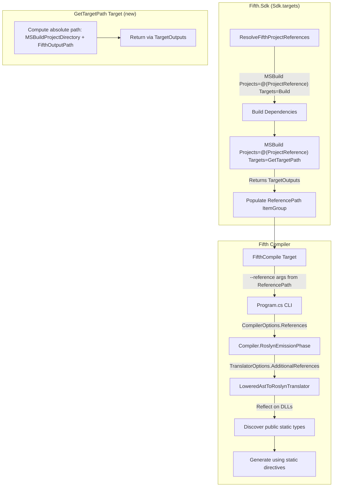
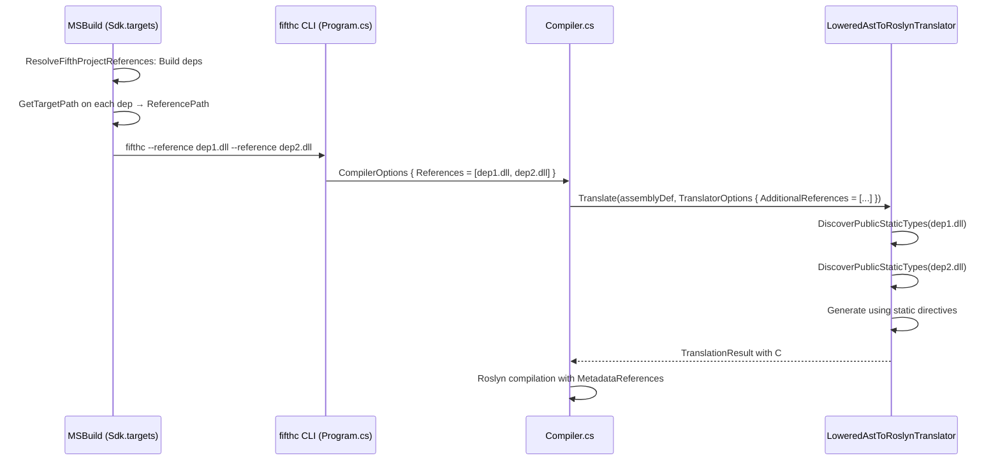

# Design Document: SDK Cross-Project References

## Overview

This feature enables multi-project Fifth solutions to build and run without manual MSBuild workarounds. Two coordinated changes are required:

1. **SDK (`Sdk.targets`)**: Add a `GetTargetPath` target that returns the absolute output assembly path, and update `ResolveFifthProjectReferences` to call `GetTargetPath` on each dependency after building it, populating the `ReferencePath` item group automatically.

2. **Compiler (`LoweredAstToRoslynTranslator.cs`)**: Pass `--reference` paths through to the translator via `TranslatorOptions.AdditionalReferences`, then inspect those assemblies for public static types and generate C# `using static` directives so that cross-project function calls (e.g., `square(7)`) resolve in the emitted C#.

The end result: a project graph like `App (Exe) → MathLib (Library) → CoreLib (Library)` builds with `dotnet build` and runs correctly, with `.5thproj` files containing only standard properties and `ProjectReference` elements.

## Architecture

The feature touches two independent subsystems that cooperate at the `--reference` CLI boundary:



### Design Decisions

1. **Absolute path via `$(MSBuildProjectDirectory)\$(FifthOutputPath)`**: MSBuild evaluates `FifthOutputPath` relative to the project being built, but when a referencing project reads the result, relative paths resolve against the wrong directory. Prepending `$(MSBuildProjectDirectory)` ensures correctness regardless of which project queries `GetTargetPath`.

2. **Two-pass MSBuild call in `ResolveFifthProjectReferences`**: First call builds dependencies (`Targets="Build"`), second call queries `GetTargetPath` (`Targets="GetTargetPath"`). This is the standard MSBuild pattern used by the .NET SDK itself. The two calls are necessary because `GetTargetPath` must run after `Build` has produced the output assembly.

3. **Reflection-based type discovery in the translator**: The translator uses `System.Reflection.MetadataLoadContext` (or direct `Assembly.LoadFrom` in a metadata-only context) to inspect referenced DLLs for public static types. This is lightweight and doesn't execute any code from the referenced assemblies.

4. **Extending `IBackendTranslator` vs. passing options through constructor**: Rather than changing the `IBackendTranslator.Translate(AssemblyDef)` interface signature (which would break all implementations), the `LoweredAstToRoslynTranslator` gains a new `Translate(AssemblyDef, TranslatorOptions?)` overload. The `Compiler.RoslynEmissionPhase` method constructs `TranslatorOptions` with `AdditionalReferences` populated from `CompilerOptions.References` and calls the new overload.

5. **`using static` generation follows existing pattern**: The translator already emits `using static Fifth.System.Functional`, `using static Fifth.System.IO`, etc. The same pattern extends naturally to user-provided referenced assemblies — for each public static type discovered, a `using static Namespace.TypeName` directive is added.


## Components and Interfaces

### 1. SDK Component: `Sdk.targets`

**File**: `src/Fifth.Sdk/Sdk/Sdk.targets`

#### New Target: `GetTargetPath`

```xml
<Target Name="GetTargetPath"
        Outputs="$(_FifthAbsoluteOutputPath)">
  <PropertyGroup>
    <_FifthAbsoluteOutputPath Condition="!$([System.IO.Path]::IsPathRooted('$(FifthOutputPath)'))">$(MSBuildProjectDirectory)\$(FifthOutputPath)</_FifthAbsoluteOutputPath>
    <_FifthAbsoluteOutputPath Condition="$([System.IO.Path]::IsPathRooted('$(FifthOutputPath)'))">$(FifthOutputPath)</_FifthAbsoluteOutputPath>
  </PropertyGroup>
</Target>
```

This target:
- Checks if `FifthOutputPath` is already absolute using `System.IO.Path.IsPathRooted`
- If relative, prepends `$(MSBuildProjectDirectory)\` to make it absolute
- Returns the result via `Outputs` so callers receive it through `TargetOutputs`

#### Modified Target: `ResolveFifthProjectReferences`

```xml
<Target Name="ResolveFifthProjectReferences" Condition="'@(ProjectReference)' != ''">
  <!-- Validate references exist -->
  <ItemGroup>
    <_FifthMissingProjectReference Include="@(ProjectReference)" Condition="!Exists('%(Identity)')" />
  </ItemGroup>
  <Error Condition="'@(_FifthMissingProjectReference)' != ''"
         Text="Missing project references: @(_FifthMissingProjectReference, ', ')" />

  <!-- Build all dependencies first -->
  <MSBuild Projects="@(ProjectReference)"
           Targets="Build"
           Properties="Configuration=$(Configuration);TargetFramework=$(TargetFramework)"
           BuildInParallel="$(BuildInParallel)" />

  <!-- Query each dependency for its output path -->
  <MSBuild Projects="@(ProjectReference)"
           Targets="GetTargetPath"
           Properties="Configuration=$(Configuration);TargetFramework=$(TargetFramework)">
    <Output TaskParameter="TargetOutputs" ItemName="ReferencePath" />
  </MSBuild>
</Target>
```

### 2. Compiler Component: `Compiler.cs` (RoslynEmissionPhase)

**File**: `src/compiler/Compiler.cs`

The `RoslynEmissionPhase` method is modified to pass reference paths to the translator:

```csharp
// Create the Roslyn translator
var translator = new LoweredAstToRoslynTranslator();

// Pass reference paths to the translator via options
var translatorOptions = new TranslatorOptions
{
    AdditionalReferences = options.References?.Where(r => !string.IsNullOrWhiteSpace(r) && File.Exists(r)).ToList()
};

// Translate the AST to C# sources (new overload)
var translationResult = translator.Translate(assemblyDef, translatorOptions);
```

### 3. Translator Component: `LoweredAstToRoslynTranslator.cs`

**File**: `src/compiler/LoweredToRoslyn/LoweredAstToRoslynTranslator.cs`

#### New Overload: `Translate(AssemblyDef, TranslatorOptions?)`

A new public overload that accepts `TranslatorOptions` and passes it through to `TranslateAssembly`:

```csharp
public TranslationResult Translate(AssemblyDef assembly, TranslatorOptions? options)
{
    return TranslateAssembly(assembly, options);
}
```

The existing `Translate(AssemblyDef)` overload (from `IBackendTranslator`) continues to call `TranslateAssembly(assembly, null)` for backward compatibility.

#### Modified: `BuildSyntaxTreeFromModule`

After the existing `using static` directives for `Fifth.System.*` types are built, a new block inspects `TranslatorOptions.AdditionalReferences`:

```csharp
// After existing using directives...
if (options?.AdditionalReferences != null)
{
    foreach (var refPath in options.AdditionalReferences)
    {
        var discoveredTypes = DiscoverPublicStaticTypes(refPath);
        foreach (var fullTypeName in discoveredTypes)
        {
            if (usingTracker.Add($"static:{fullTypeName}"))
            {
                usingDirectives.Add(
                    UsingDirective(ParseName(fullTypeName))
                        .WithStaticKeyword(Token(SyntaxKind.StaticKeyword)));
            }
        }
    }
}
```

#### New Method: `DiscoverPublicStaticTypes`

```csharp
private static IReadOnlyList<string> DiscoverPublicStaticTypes(string assemblyPath)
```

This method:
1. Loads the assembly metadata using `MetadataLoadContext` (or `Assembly.ReflectionOnlyLoadFrom` equivalent)
2. Iterates all exported types
3. Filters for `public static class` types that contain at least one `public static` method
4. Returns fully qualified type names (e.g., `"CoreLib.Program"`)

Uses `System.Reflection.MetadataLoadContext` for safe metadata-only inspection without loading assemblies into the execution context.

### 4. `TranslatorOptions` (existing class, no changes needed)

**File**: `src/compiler/LoweredToRoslyn/LoweredAstToRoslynTranslator.cs` (lines 19-23)

```csharp
public class TranslatorOptions
{
    public bool EmitDebugInfo { get; set; } = true;
    public IReadOnlyList<string>? AdditionalReferences { get; set; }
}
```

The `AdditionalReferences` property already exists and is currently unused. This feature activates it.

### Interface Flow




## Data Models

### MSBuild Properties and Items

| Property/Item | Scope | Description |
|---|---|---|
| `FifthOutputPath` | Per-project | Relative or absolute path to the output assembly (e.g., `bin\Debug\net8.0\CoreLib.dll`) |
| `_FifthAbsoluteOutputPath` | Internal to `GetTargetPath` | Computed absolute path: `$(MSBuildProjectDirectory)\$(FifthOutputPath)` when relative |
| `ReferencePath` | Per-project ItemGroup | Populated by `ResolveFifthProjectReferences` with absolute paths to dependency assemblies |
| `ProjectReference` | Per-project ItemGroup | Standard MSBuild item listing `.5thproj` dependencies |

### Compiler Data Flow

| Data | Type | Source | Destination |
|---|---|---|---|
| `--reference` args | `string[]` | MSBuild `FifthCompile` target | `CompilerOptions.References` |
| `CompilerOptions.References` | `IReadOnlyList<string>?` | CLI parsing in `Program.cs` | `Compiler.RoslynEmissionPhase` |
| `TranslatorOptions.AdditionalReferences` | `IReadOnlyList<string>?` | `RoslynEmissionPhase` | `LoweredAstToRoslynTranslator` |
| Discovered type names | `IReadOnlyList<string>` | `DiscoverPublicStaticTypes` | `BuildSyntaxTreeFromModule` using directives |

### Discovered Type Model

The `DiscoverPublicStaticTypes` method returns fully qualified type names as strings. A type qualifies for `using static` generation when:

1. The type is `public` and `static` (i.e., `abstract` + `sealed` in IL terms)
2. The type contains at least one `public static` method
3. The type is not a compiler-generated type (no `<` in name, no `CompilerGenerated` attribute)

Example: Given a `CoreLib.dll` containing:
```csharp
namespace CoreLib
{
    public static class Program
    {
        public static int Square(int x) => x * x;
    }
}
```

`DiscoverPublicStaticTypes("CoreLib.dll")` returns `["CoreLib.Program"]`, and the translator emits `using static CoreLib.Program;` in the generated C#.

### Sample `.5thproj` File (Post-Fix)

```xml
<Project Sdk="Fifth.Sdk">
  <PropertyGroup>
    <OutputType>Exe</OutputType>
    <TargetFramework>net8.0</TargetFramework>
    <FifthCompilerCommand>fifthc</FifthCompilerCommand>
  </PropertyGroup>
  <ItemGroup>
    <ProjectReference Include="..\MathLib\MathLib.5thproj" />
    <ProjectReference Include="..\CoreLib\CoreLib.5thproj" />
  </ItemGroup>
</Project>
```

No `GetTargetPath` override, no `PopulateFifthReferencePaths`, no `DefaultTargets="Build"`.


## Correctness Properties

*A property is a characteristic or behavior that should hold true across all valid executions of a system — essentially, a formal statement about what the system should do. Properties serve as the bridge between human-readable specifications and machine-verifiable correctness guarantees.*

### Property 1: Absolute Path Resolution

*For any* project directory string and any relative `FifthOutputPath` string, combining them via `Path.Combine(projectDir, outputPath)` should produce a rooted (absolute) path. Conversely, *for any* already-absolute `FifthOutputPath`, the resolution should return the path unchanged.

**Validates: Requirements 1.2, 1.3, 8.1, 8.2, 8.3**

### Property 2: Public Static Type Discovery Completeness

*For any* valid .NET assembly containing N public static classes that each have at least one public static method, `DiscoverPublicStaticTypes` should return exactly N fully qualified type names, and each returned name should correspond to a type that is public, static, and contains at least one public static method.

**Validates: Requirements 3.1, 3.2, 3.3**

### Property 3: Using Static Generation Correctness

*For any* set of referenced assembly paths where each assembly contains public static types with public static methods, the generated C# compilation unit should contain a `using static` directive for each discovered type, and each directive should use the fully qualified type name (namespace + class name).

**Validates: Requirements 4.1, 4.2**

### Property 4: No Duplicate Using Static Directives

*For any* set of referenced assemblies (including cases where multiple assemblies export types with the same fully qualified name), the generated C# compilation unit should contain at most one `using static` directive per unique fully qualified type name.

**Validates: Requirements 4.3**

### Property 5: Backward Compatibility — No Extra Directives Without References

*For any* Fifth module translated with `AdditionalReferences` set to null or empty, the set of `using static` directives in the generated C# should be identical to the set produced by the current translator (i.e., only `Fifth.System.Functional`, `Fifth.System.List`, `Fifth.System.IO`, `Fifth.System.Math`, and any namespace-import-derived directives).

**Validates: Requirements 4.4, 9.2, 9.3**

## Error Handling

### SDK Error Handling

| Condition | Behavior |
|---|---|
| `ProjectReference` points to non-existent `.5thproj` file | `ResolveFifthProjectReferences` emits MSBuild error: "Missing project references: ..." (existing behavior, unchanged) |
| Dependency project build fails | MSBuild propagates the build failure; `GetTargetPath` is never called (standard MSBuild behavior) |
| `FifthOutputPath` is empty or unset | `GetTargetPath` returns empty string; `FifthCompile` will fail at compilation time with existing validation |

### Compiler Error Handling

| Condition | Behavior |
|---|---|
| `--reference` path does not exist | `DiscoverPublicStaticTypes` logs a warning diagnostic and returns empty list; compilation continues (Req 3.4) |
| `--reference` path is not a valid .NET assembly | `DiscoverPublicStaticTypes` catches the exception, logs a warning diagnostic, and returns empty list |
| `MetadataLoadContext` fails to load assembly | Same as above — warning + empty list |
| Referenced assembly has no public static types | No additional `using static` directives generated; no warning (this is normal for assemblies that only export instance types) |
| Duplicate type names across assemblies | The `usingTracker` `HashSet` prevents duplicate directives (existing dedup mechanism in `BuildSyntaxTreeFromModule`) |

### Diagnostic Messages

- Warning for missing reference: `"Referenced assembly not found: {path}"` (code: `REF001`)
- Warning for unloadable reference: `"Could not load referenced assembly: {path}: {exception.Message}"` (code: `REF002`)

## Testing Strategy

### Unit Tests (xUnit + FluentAssertions)

Unit tests verify specific examples and edge cases:

1. **`DiscoverPublicStaticTypes` tests**:
   - Assembly with one public static class → returns that class name
   - Assembly with no public static classes → returns empty list
   - Assembly with mix of static and non-static classes → returns only static ones
   - Non-existent path → returns empty list + warning diagnostic
   - Invalid DLL file → returns empty list + warning diagnostic

2. **`BuildSyntaxTreeFromModule` using directive tests**:
   - Module with no additional references → default using directives only
   - Module with one reference containing one public static type → adds one `using static`
   - Module with multiple references → adds `using static` for each discovered type
   - Duplicate type across references → only one `using static` emitted

3. **SDK integration tests** (existing `test/fifth-sdk-tests/`):
   - Build a multi-project sample and verify exit code 0
   - Verify `ReferencePath` is populated after `ResolveFifthProjectReferences`
   - Verify clean `.5thproj` files work without workarounds

4. **End-to-end tests**:
   - Build and run `FullProjectExample` sample
   - Verify `square(7)` returns 49 and `add(49, 3)` returns 52

### Property-Based Tests (FsCheck + xUnit)

The project should add `FsCheck` and `FsCheck.Xunit` NuGet packages to the relevant test project (`test/runtime-integration-tests/` or `test/ast-tests/`).

Each property test runs a minimum of 100 iterations.

Each property test is tagged with a comment referencing the design property:

```csharp
// Feature: sdk-cross-project-references, Property 1: Absolute Path Resolution
```

**Property test implementations**:

1. **Property 1: Absolute Path Resolution**
   - Generate random directory paths and random relative file paths
   - Verify that combining them always produces a rooted path
   - Generate random absolute paths and verify they are returned unchanged

2. **Property 2: Public Static Type Discovery Completeness**
   - Generate test assemblies (via Roslyn in-memory compilation) with random numbers of public static classes, each with random numbers of public static methods, plus non-static classes as noise
   - Verify that `DiscoverPublicStaticTypes` returns exactly the public static types with methods

3. **Property 3: Using Static Generation Correctness**
   - Generate random sets of type names, create test assemblies containing those types
   - Translate a minimal module with those assemblies as references
   - Verify the generated C# contains `using static` for each type with the correct fully qualified name

4. **Property 4: No Duplicate Using Static Directives**
   - Generate random sets of type names including intentional duplicates across multiple assemblies
   - Translate a minimal module with those assemblies as references
   - Verify the count of `using static` directives equals the count of distinct type names

5. **Property 5: Backward Compatibility**
   - Generate random Fifth modules (varying numbers of functions, classes, namespaces)
   - Translate with `AdditionalReferences = null`
   - Verify the using directive set matches the known default set exactly

### Test Configuration

- Property-based testing library: **FsCheck 2.x** with **FsCheck.Xunit** integration
- Minimum iterations per property: **100**
- Test projects: `test/ast-tests/` for translator unit tests, `test/runtime-integration-tests/` for integration tests
- Each property test references its design document property via comment tag

