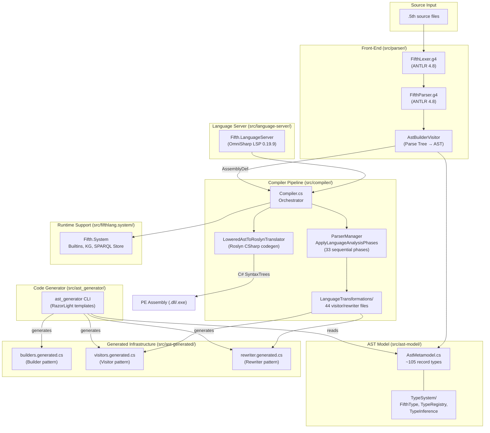
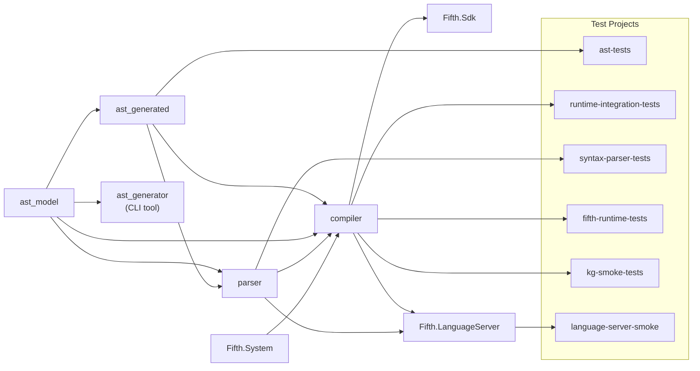
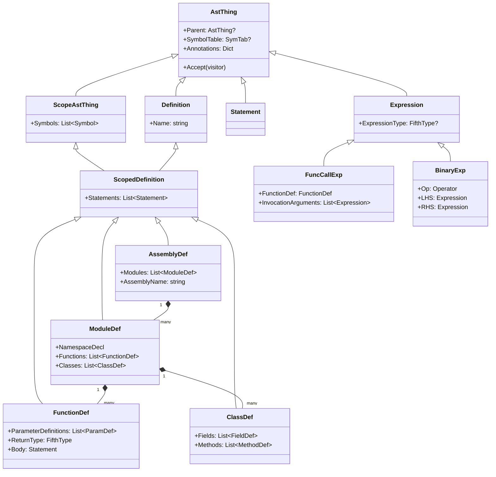
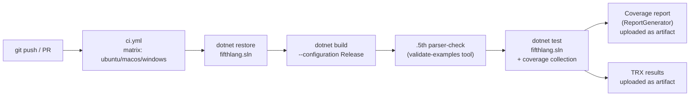

# Diagrams
**Date:** 2026-03-25 | **Repository:** aabs/fifthlang

---

## Diagram 1 — Top-Level Component Architecture

---

## Diagram 2 — Compilation Pipeline Flow

```mermaid
flowchart TD
    A["Source .5th file(s)"] --> B["ANTLR Lexer+Parser"]
    B --> C["AstBuilderVisitor\n(parse tree → AssemblyDef)"]
    C --> D["Phase 1: TreeLinkageVisitor\n(parent-child links)"]
    D --> E["Phase 2-3: Builtins + ClassCtor injection"]
    E --> F["Phase 4-8: Constructor validation\n+ SymbolTable (initial)\n+ DefiniteAssignment"]
    F --> G["Phase 9-10: PropertyToField\n+ DestructuringVisitor"]
    G --> H["Phase 11-13: Overload gathering\n+ guard validation\n+ overload transform"]
    H --> I["Phase 14-18: Lowering passes\n(destructuring, unary ops,\nSPARQL, TriG, augmented assignment)"]
    I --> J["Phase 19: TreeRelink\n(2nd TreeLinkageVisitor)"]
    J --> K["Phase 20-22: KG/Triple passes\n(diagnostics, expansion, graph addition)"]
    K --> L["Phase 23-25: SymbolTable (final)\n+ VarRefResolver\n+ TypeAnnotation"]
    L --> M["Phase 26-27: Query application\ntype-check + lowering"]
    M --> N["Phase 28-29: ListComprehension\nlowering + SPARQL validation"]
    N --> O["Phase 30-33: Lambda validation\n+ closure conversion\n+ defunctionalisation\n+ tail-call optimisation"]
    O --> P["LoweredAstToRoslynTranslator\n(AssemblyDef → C# SyntaxTrees)"]
    P --> Q["Roslyn CSharpCompilation\n(Emit PE + PDB)"]
    Q --> R["PE Assembly\n+ .runtimeconfig.json\n+ runtime deps"]

    style I fill:#ffe0b2
    style K fill:#e1f5fe
    style L fill:#e8f5e9
    style P fill:#f3e5f5
```

---

## Diagram 3 — Subsystem Dependency Graph

---

## Diagram 4 — Core AST Data Model (Selected Key Types)

---

## Diagram 5 — CI Pipeline

